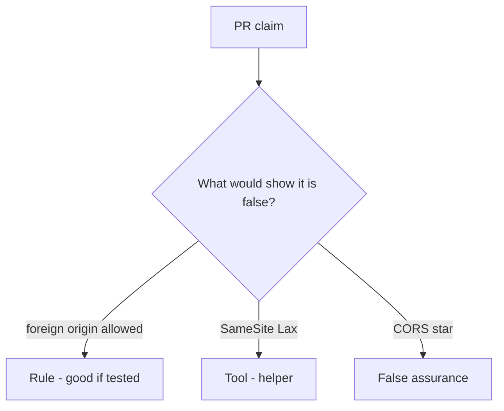

# Review of a cookie-only share POST

**Kind:** code-review
**Loop step:** Review

## What you are reviewing

This is a share-route review. Does `allow_share` still return true for a foreign origin with `token=None`?

If `test_foreign_origin_post_is_denied` still fails, “will add CSRF later” is not the review.

## Picture: leftover cookie auth + no Origin check

**Cookie auth + no Origin check**.

A foreign origin without a token still has to be denied. If the change never checks origin and token, that leftover-cookie path is still open. SameSite=Lax without that test is still the same problem.

Leftover cookies are leftover permission from login — a signed-in session cookie that rides along — used as if it were consent for this person, this share, and this origin.

## Problems to find (name them yourself)

- Cookie auth + no Origin check
- GET `/share?to=`
- CORS `*` with credentials
- Token in a cookie not bound to the session

Also reject: live third-party CSRF; closing findings without re-running `test_foreign_origin_post_is_denied`; keys in lessons.

## Common mix-ups

- SameSite is CSRF done
- JSON APIs cannot CSRF
- CORS is CSRF defense
- Logged-in cookie is consent
- Fetch metadata alone is this check

## Use it somewhere new

SameSite=Lax without an origin-and-token test still leaves leftover cookies. SameSite=Lax is not origin-and-token — write the foreign-origin deny.

## What this page is not doing

Postpone CSRF in a comment and nobody owns the foreign-origin deny. Do not visit a live third-party page to prove the finding.
