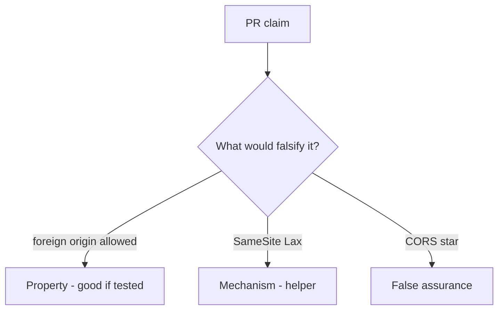

# 6.3-LO-08 — Review cookie-only share POST as a PR, not a SameSite ticket

**Kind:** code-review
**Loop step:** Review
**Standards:** OWASP ASVS 5.0.0 (final) `v5.0.0-3.5.1`.

## Review the fixture as if it were SecureCollab share

Review `labs/6.3/6.3-lab/vulnerable/` as a SecureCollab PR. Your job is not to count suspicious lines. Reconstruct whether `allow_share` for a foreign origin with `token=None` is still true, compare that with the module invariant, and write changes a developer can verify.

Intended findings live only in `content/assessment/keys/6.3.md` — not here. Do not open the keys file until your review has been evaluated.

## Mental model: Cookie auth + no Origin check

Start with this seeded smell: **Cookie auth + no Origin check**. Label it property, mechanism, or false assurance before you accept the PR.

Classification starts at the protected effect (foreign origin without token denied). Everything that is not origin×token at that call is a candidate ambient-cookie path. SameSite=Lax without that test is the same smell, not a different finding class.

## Seeded smells (label them yourself)

- Cookie auth + no Origin check
- GET `/share?to=`
- CORS `*` with credentials
- Token in a cookie not bound to the session

Also reject: live third-party CSRF; closing findings without re-running `test_foreign_origin_post_is_denied`; keys in lessons.

## Misconceptions this module refuses

- SameSite is CSRF done
- JSON APIs cannot CSRF
- CORS is CSRF defense
- Logged-in cookie is consent
- Fetch Metadata alone is this pytest

## Practice

Write three review notes a maintainer could act on. Each note: observation, property or false assurance, suggested structural change, residual you will **not** delete. Tie at least one to `test_foreign_origin_post_is_denied`.

## Transfer

Clinic PR that “set SameSite=Lax” without an origin×token test is an incomplete mediation review. Name the independent falsehood that would still keep a foreign origin from sharing.

## Non-goals

Do not merge by adding a comment “will add CSRF later.” That comment is a residual without an owner. Do not visit a live third-party page to prove the finding.
