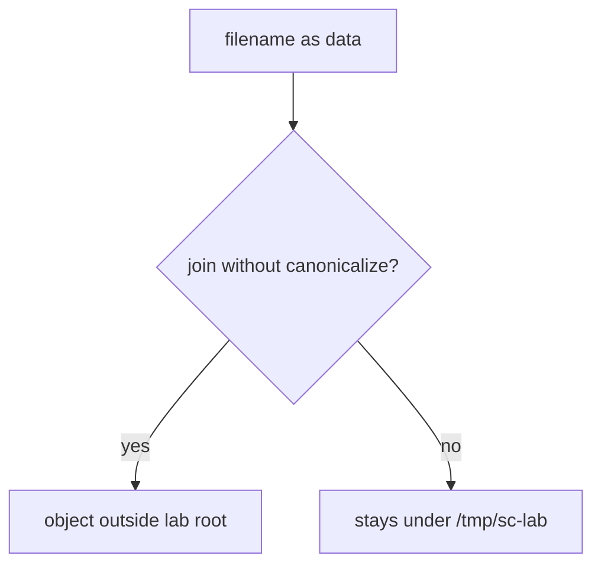
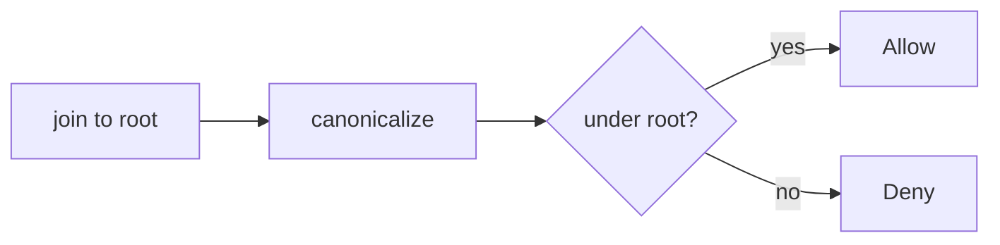

# 6.4-LO-01 — A filename is data, not a filesystem object

**Kind:** concept-model
**Loop step:** 1 Property
**Standards:** OWASP ASVS 5.0.0 (final) `v5.0.0-5.3.2`, `v5.0.0-5.3.1`, `v5.0.0-5.2.2`; `v5.0.0-5.3.3` is **Level 3, advanced**. CWE-22/434/502 are *awareness after* the cause. Starlette `UploadFile.filename` is not this sentence.

## The claim this module owns

SecureCollab Phase 1 stores an upload under a lab root. The **filename is data**. After join and canonicalize, the object must still be that root. Module 6.1 taught data vs interpreter grammar; this module’s cell is **which file object** the path parser selected.

> `resolve` must not return a path outside `/tmp/sc-lab`. A `../` name is data that tried to become a different object. This lab asserts prefix and raises; it does not read host files.

The forbidden outcome is **a resolved path that escapes the lab root**. That is a 1.1 authorization failure of *which object* plus integrity of the host store.

ASVS `v5.0.0-5.3.2` wants internally generated names or strict validation of user filenames (path traversal / LFI / RFI / SSRF). `v5.0.0-5.3.1` wants uploaded files not executed as server code. `v5.0.0-5.2.2` wants extension matching content. `v5.0.0-5.3.3` (zip slip / ignore user paths inside archives) is **Level 3, advanced**.

## Mental model: path grammar mixed with data



The attacker is an uploader who controls a filename field. Trust is local `resolve()` under `/tmp/sc-lab`. Do not open host files outside this fixture.

**Mechanism (not the property):** a UUID stored name, an antivirus product, or a denylist of `..`.

## Mental model: join, canonicalize, then prefix



Stripping `..` without canonicalize still fails on encodings (2.1). UUID names without a prefix check still fail if you later join the original filename.

## Root cause vs impact vs prevention vs detection vs recovery

| Slice | For this property |
|---|---|
| Root cause | Path grammar mixed with data; no canonicalization |
| Preconditions | `resolve('../outside')` leaves the root |
| Trigger | User-supplied relative segments |
| Impact | Authorization of which file object |
| Prevention | Join + canonicalize + prefix; random stored names; never execute uploads |
| Detection | `path_escape_denied` |
| Recovery | Audit the store; restore |

## Framework defaults versus the path guarantee

Starlette `UploadFile.filename` is hostile. FastAPI does not canonicalize for you. Content-Type is a client claim (2.1).

## Mechanism limits

- `.png` allow-lists still fail if a processor parses XML (XXE) — named residual.
- Zip members, absolute names, UNC, symlink (`v5.0.0-5.2.5` Level 3) — named, not this fixture.
- Pickle / unsafe YAML / XML entity expansion are other interpreters (6.1 shape).
- Image codecs (memory) wait for E4.

## Practice

Treat `../` as a test *name*, not a cookbook to fire at other hosts. Then run:

```
python3 -m pytest labs/6.4/6.4-lab/tests --impl vulnerable
python3 -m pytest labs/6.4/6.4-lab/tests --impl fixed
```

The first command must fail. The second must pass.

## Transfer

Clinic scan upload. XML entity expansion; pickle; YAML load.

## Non-goals

Live filesystem trophies, zip-bomb cookbooks, dumping lab Python into notes. Gates 0–10 and milestones M0–M5 stay **not-attempted**. Answer keys are not in this file.
