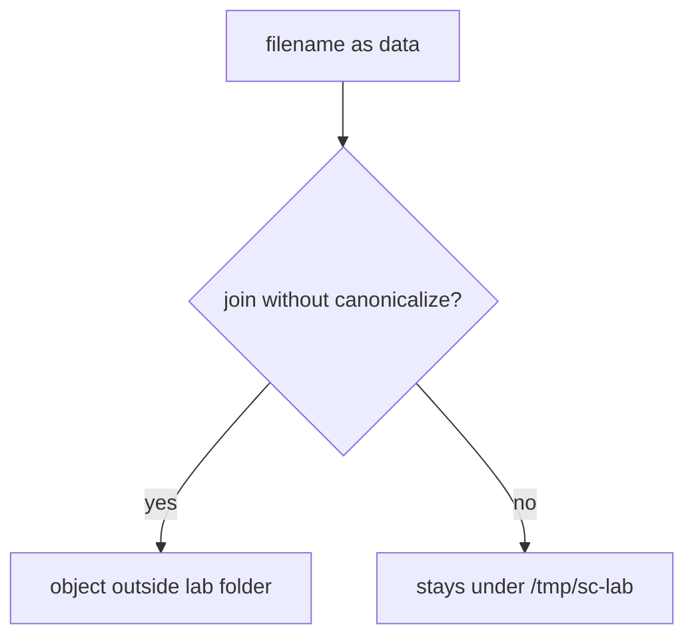
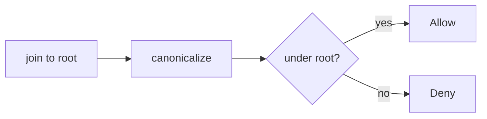

# A filename is data, not a filesystem object

**Kind:** concept-model
**Loop step:** 1 Property

## The rule

The notes app stores an upload under a lab folder. The **filename is data**. After you join it to the folder and canonicalize, the object must still be that folder. An earlier topic taught data vs interpreter grammar; the rule here is **which file object** the path parser selected.

> `resolve` must not return a path outside `/tmp/sc-lab`. A `../` name is data that tried to become a different object. This practice checks the prefix and raises; it does not read host files.

A **resolved path must stay in the lab folder**. That is a who-is-allowed failure of *which object*, plus whether the host store stays honest.

A famous-bugs list may call this a “path walk.” The rule here is still the resolved prefix. Internally generated names, a hard check on user filenames, not running uploads as server code, and matching extension to content do not prove the object stayed under `/tmp/sc-lab`. Zip entries that walk out are a later leftover. Starlette `UploadFile.filename` is not the prefix check.

## Picture: path grammar mixed with data



Picture an uploader who controls a filename field. Local `resolve()` under `/tmp/sc-lab`. Do not open host files outside this practice.

A UUID stored filename, an antivirus product, and a denylist of `..` do not keep a canonical path under the folder.

## Picture: join, canonicalize, then prefix



Stripping `..` without canonicalize still fails on encodings. UUID names without a prefix check still fail if you later join the original filename.

## Why it happens, what it costs, how you stop it, how you notice, how you recover

| Slice | For this rule |
|---|---|
| Why it happens | Path grammar mixed with data; no canonicalization |
| What's already wrong | `resolve('../outside')` leaves the folder |
| Trigger | User-supplied relative segments |
| What it costs | Who is allowed to pick which file object; the host store can change |
| How you stop it | Join + canonicalize + prefix; random stored names; never run uploads as code |
| How you notice | `path_escape_denied` |
| How you recover | Audit the store; restore |

## What the framework does vs what you still have to check

Starlette `UploadFile.filename` is hostile. FastAPI does not canonicalize for you. Content-Type is a client claim. After join and canonicalize, the object is still `/tmp/sc-lab` or a child — files in `labs/6.4/6.4-lab`. No live walk against a public upload folder.

## What the tool cannot do

- `.png` allow-lists still fail if a processor parses XML (entity expansion) — leftover you name.
- Zip members, absolute names, UNC, symlink follow — leftover, not this practice.
- Pickle / unsafe YAML / XML entity expansion are other interpreters (same shape as the earlier data-vs-grammar topic).
- Image codecs (memory) wait for a later elective.

## Practice

Treat `../` as a test *name*, not a cookbook to fire at other hosts. Then run:

```text
python3 -m pytest labs/6.4/6.4-lab/tests --impl vulnerable
python3 -m pytest labs/6.4/6.4-lab/tests --impl fixed
```

A path that left the folder is the check. An awareness-list name is a nickname.

## Use it somewhere new

A scan upload is this grain. XML entity expansion, pickle, and YAML load are the same parser shape.

## What this page is not doing

Do not use live filesystem trophies, zip-bomb cookbooks, and treating an awareness list as the definition of security. Answer keys are not on this site.
