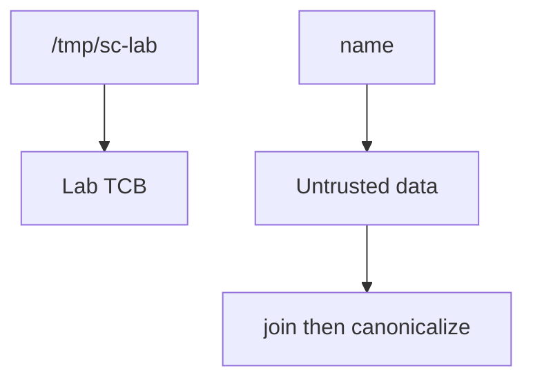
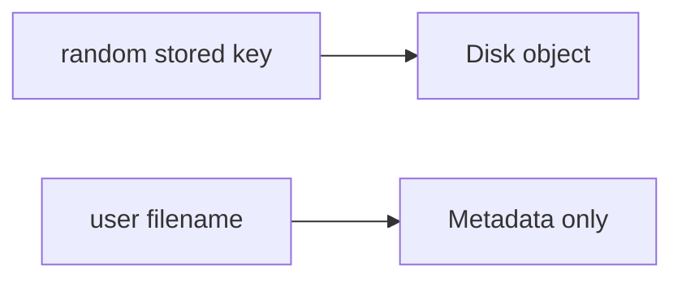

# 6.4-LO-02 — A prefix map a second engineer can test

**Kind:** design-exercise
**Loop step:** 2 Model
**Standards:** OWASP ASVS 5.0.0 (final) `v5.0.0-5.3.2`.

## Can a second engineer name pytest cases from your path map?

“We store UUID names” is not this lesson. A reviewable model names **the root, the canonicalize step, and which parsers are out of this fixture**.

SecureCollab Phase 1 freeze: local `resolve(name)` under `/tmp/sc-lab`. No live host reads.

## Mental model: the object is the canonical path

If the canonical result is not the root or a child of the root, deny.

## Mental model: stored name vs display name

A random stored name is extra. It is not a substitute for the prefix check on any path you still join.

## Step 1: freeze pieces

| Piece | This system |
|---|---|
| Subjects | uploader |
| Objects | file under lab root |
| Actions | `resolve` |
| Channels | filename field |
| TCB | canonical prefix `/tmp/sc-lab` |
| Untrusted | `name` |
| State / time | one resolve |
| 1.1 cell | which file object |

## Step 2: write cells

| Subject | Object | Action | Decision |
|---|---|---|---|
| app | `notes/a.txt` | resolve | under root |
| attacker | `../outside` | resolve | deny |
| zip member | stored path | unpack | 5.3.3 advanced |
| XML | entity | expand | named residual |

## Practice

Draw join → canonicalize → prefix. Point at `labs/6.4/6.4-lab` file `path.py`.

## Transfer

Clinic scan filename; zip member names.

## Residual risk

Zip slip Level 3; XML/pickle; codecs (E4).

## Non-goals

Top 10 as the definition of security. Keys stay out of lessons.
