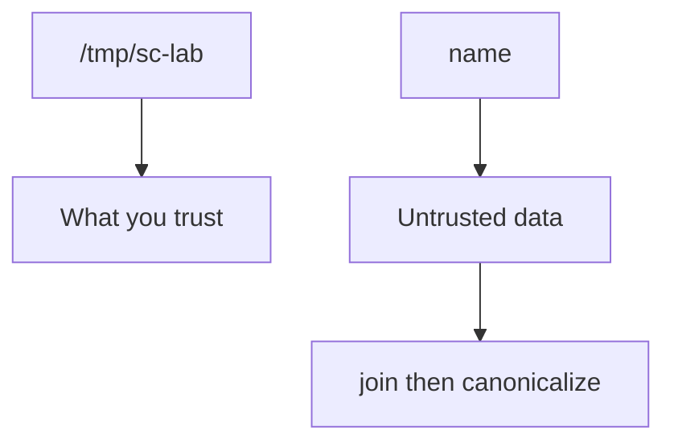
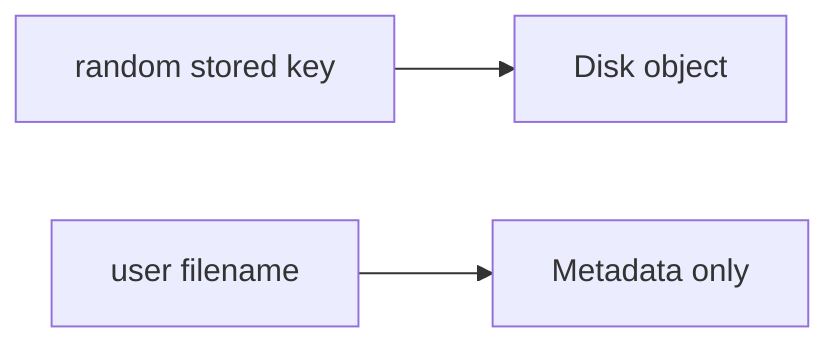

# A prefix map someone else can test

**Kind:** design-exercise
**Loop step:** 2 Model

## Could someone else name checks from your map?

“We store UUID names” is not this page. A reviewable model names **the folder, the canonicalize step, and which parsers are out of this practice**.

This week’s freeze: a local `resolve(name)` practice under `/tmp/sc-lab`. No live host reads.

## Picture: the object is the canonical path

If the canonical result is not the folder or a child of the folder, deny.

## Picture: stored name vs display name

A random stored name is extra. It is not a substitute for the prefix check on any path you still join.

## Step 1: freeze who, what, and the path

| Piece | This system |
|---|---|
| Who | Uploader |
| What | File under the lab folder |
| Actions | `resolve` |
| Paths | Filename field |
| What you trust | Canonical prefix `/tmp/sc-lab` |
| What you do not trust | `name`; a denylist of `..`; a UUID sticker; Content-Type |
| State / time | One resolve |
| The rule | Which file object you selected |

## Step 2: write rows the lab can fail

| Who | What | Action | Decision |
|---|---|---|---|
| app | `notes/a.txt` | resolve | under folder |
| attacker | `../outside` | resolve | deny |
| zip member | stored path | unpack | leftover, later and harder |
| XML | entity | expand | leftover you name |

## Practice

Draw join → canonicalize → prefix so someone else could name the checks. Point at `labs/6.4/6.4-lab` file `path.py`.

## Use it somewhere new

Clinic scan filename; zip member names.

## What can still go wrong

Zip members that walk out; XML/pickle; image codecs later.

## What this page is not doing

Treating an awareness list as the definition of security. Answer keys are not on this site.
