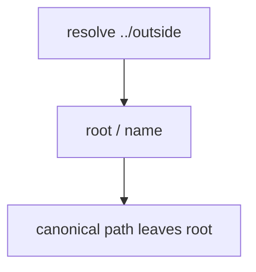

# 6.4-LO-03 — Observe prefix failure, do not trophy the host

**Kind:** mechanism-lab
**Loop step:** 3 Break
**Standards:** OWASP ASVS 5.0.0 (final) `v5.0.0-5.3.2`.

## Authorized scope

`labs/6.4/6.4-lab` only. Synthetic names. Tests must not read host files outside the lab root.

**Forbidden outcome:** Resolved path escapes the lab root.

## Mental model: join without canonicalize



The vulnerable tree demonstrates **cause** (path grammar mixed with data). The name `../outside` is data. Do not use it against other directories.

## What to read in the fixture

`vulnerable/path.py` joins the name onto `/tmp/sc-lab` and returns the string without canonicalize-and-prefix. Tests resolve that string and require it still start with the lab root, or that `resolve` raise `ValueError`.

## Root cause vs impact

| Slice | Lab |
|---|---|
| Root cause | Path grammar mixed with data; no canonicalization |
| Impact | Object outside the note store |
| Not the lesson | A CWE-22 sticker as the definition |

## Practice

```
python3 -m pytest labs/6.4/6.4-lab/tests --impl vulnerable
```

Record `test_dotdot_does_not_escape_root`. Do not open host files.

## Transfer

Clinic scan upload. Predict without leaving this directory.

## Non-goals

No live-target instructions. Synthetic data only.
