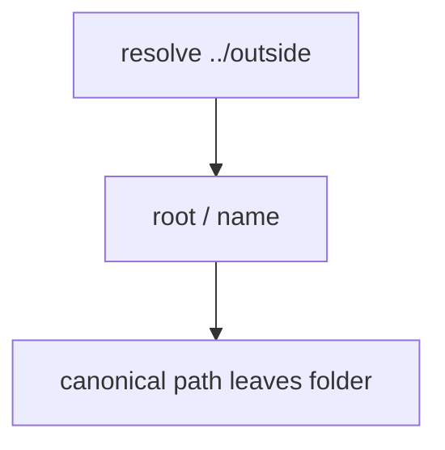

# Practice: a resolved path leaves the lab folder

**Kind:** mechanism-lab
**Loop step:** 3 Break

## Try it

The practice is not a website you attack. It is a tiny in-process `resolve`. It does not open a live upload folder, an employer imaging store, or a classmate preview. The failure is already in the object: the name is joined onto the folder and returned as a string, with no canonicalize-and-prefix. That is a **failed rule**, not a clumsy filename.

The rule under test:

> After join and canonicalize, `resolve` must still be `/tmp/sc-lab` or a child. A filename is data, not a filesystem object.

## Where you may practice

Only `labs/6.4/6.4-lab` is in scope. Fake names under the lab folder `/tmp/sc-lab`. Tests must not read host files outside that folder. Restore the broken and repaired folders when you are done.

Do not open a live upload folder. Do not walk a public filesystem. Do not point this exercise at an employer imaging store, a classmate preview, or anyone else’s disk.

What must not happen: a resolved path leaves the lab folder. `resolve("../outside")` joins onto `/tmp/sc-lab` and, after canonicalize, is no longer that folder or a child of it.

Who could do this: a member who can supply an upload **filename** (data). That stands in for a clinic scan name, a zip member path (leftover, later and harder), or `UploadFile.filename` from Starlette. What is supposed to stop this: `resolve` joins, canonicalizes, and denies unless the object is still `/tmp/sc-lab` or a child. A denylist of `..`, a UUID filename sticker, and `Content-Type` are not enough.

## Picture: join without canonicalize



The broken files show **cause** (path grammar mixed with data). The name `../outside` is **data**. Do not use it against other directories. What has to be true first: `resolve` returns `str(ROOT / name)` without canonicalize-and-prefix. You do not need to `open()` the result. You must not.

An awareness list that names “path walk” is not the failing check.

## What to look at: the cause, not a trophy

Read `vulnerable/path.py`. It joins the name onto `/tmp/sc-lab` and returns the string. Checks:

- `test_dotdot_does_not_escape_root` — `ValueError` **or** resolved path still under the folder
- `test_honest_relative_stays_under_root`

You do not need a new name. The failure of `test_dotdot_does_not_escape_root` *is* the evidence.

## Why it happens, what it costs, how you stop it, how you notice, how you recover

| Slice | This practice |
|---|---|
| The rule | Resolved object is still under `/tmp/sc-lab` |
| Why it happens | Path grammar mixed with data; no canonicalization |
| What has to be true first | `resolve` returns join without a prefix check |
| Trigger | `resolve("../outside")` |
| What it costs | Who is allowed to pick *which object*; the host store can change |
| How you stop it | Canonicalize then prefix; fail closed if uncertain |
| How you notice | `path_escape_denied`; never the raw filename if it is a patient id |
| How you recover | Deny; audit; restore if a file landed outside |
| Not the lesson | An awareness-list name, UUID rename, or a host-file trophy |

## What the framework does vs what you still have to check

Starlette `UploadFile.filename` is client data. `pathlib.Path / name` does not canonicalize. FastAPI will write wherever you tell it. What this practice is supposed to show: `../outside` does not leave `/tmp/sc-lab`.

## Practice

```text
python3 -m pytest labs/6.4/6.4-lab/tests --impl vulnerable
```

Record the failing test `test_dotdot_does_not_escape_root`. Do not open host files. An environment or import error is not security evidence.

## Use it somewhere new

Clinic scan upload. Predict, without leaving this directory, whether joining the original scan name onto a public folder still leaves the imaging root. Do not touch a live imaging folder.

## What this page is not doing

No live-target steps. Fake names only. Do not read files outside the lab folder. Do not “fix” the practice by deleting the check.
