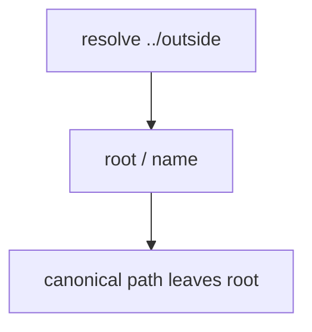

# 6.4-LO-03 — Observe prefix failure, do not trophy the host

**Kind:** mechanism-lab
**Loop step:** 3 Break
**Standards:** OWASP ASVS 5.0.0 (final) `v5.0.0-5.3.2`. `v5.0.0-5.3.3` (zip slip) is **Level 3, advanced**, not this pytest.

## Authorized scope

`labs/6.4/6.4-lab` only. The fixture is an in-process `resolve`. Synthetic names under lab root `/tmp/sc-lab`. Tests must not read host files outside that root. Do not open a live upload folder, an employer imaging store, or a classmate preview as this exercise.

**Forbidden outcome:** resolved path escapes the lab root. `resolve("../outside")` joins onto `/tmp/sc-lab` and, after canonicalize, is no longer that root or a child of it.

Attacker capability in this lab: a member who can supply an upload **filename** (data). That stands in for a clinic scan name, a zip member path (Level 3 residual), or `UploadFile.filename` from Starlette. Trust assumption: `resolve` is supposed to join, canonicalize, and deny unless the object is still `/tmp/sc-lab` or a child. A denylist of `..`, a UUID filename sticker, and `Content-Type` are not in the TCB for this cell.

## Mental model: join without canonicalize



The vulnerable tree demonstrates **cause** (path grammar mixed with data). The name `../outside` is **data**. Do not use it against other directories. Preconditions: `resolve` returns `str(ROOT / name)` without canonicalize-and-prefix. You do not need to `open()` the result. You must not.

ASVS `v5.0.0-5.3.2` wants internally generated names or strict validation of user filenames. CWE-22 is awareness after the cause, not this oracle.

## What to read in the fixture

`vulnerable/path.py` joins the name onto `/tmp/sc-lab` and returns the string. Tests:

- `test_dotdot_does_not_escape_root` — `ValueError` **or** resolved path still under the root
- `test_honest_relative_stays_under_root`

You do not need a new name. The failure of `test_dotdot_does_not_escape_root` *is* the evidence.

Do not open the fixed tree yet. Diagnose the cause first.

## Root cause vs impact vs prevention vs detection vs recovery

| Slice | This lab |
|---|---|
| Required property | Resolved object is still under `/tmp/sc-lab` |
| Root cause | Path grammar mixed with data; no canonicalization |
| Preconditions | `resolve` returns join without prefix check |
| Trigger | `resolve("../outside")` |
| Impact | Authorization of *which object*; integrity of the host store |
| Prevention | Canonicalize then prefix; fail closed if uncertain |
| Detection | `path_escape_denied`; never the raw filename if PHI |
| Recovery | Deny; audit; restore if a file landed outside |
| Not the lesson | A CWE-22 sticker, UUID rename, or host-file trophy |

## Framework defaults versus the object guarantee

Starlette `UploadFile.filename` is client data. `pathlib.Path / name` does not canonicalize. FastAPI will write wherever you tell it. The application guarantee is: **this** fixture, `../outside` does not leave `/tmp/sc-lab`.

## Practice

```text
python3 -m pytest labs/6.4/6.4-lab/tests --impl vulnerable
```

Record `test_dotdot_does_not_escape_root`. Do not open host files. An environment error is not security evidence.

## Transfer

Clinic scan upload. Predict without leaving this directory. Do not touch a live imaging folder.

## Non-goals

No live-target instructions. Synthetic names only. Do not read files outside the lab root.
