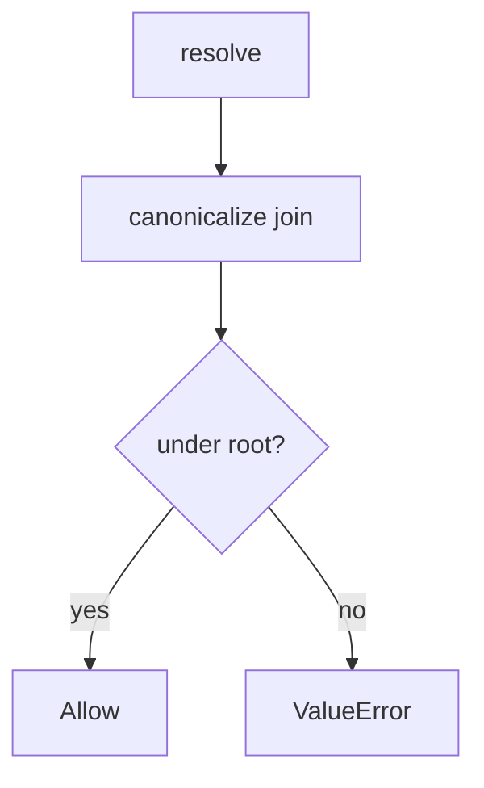

# 6.4-LO-04 — Canonicalize, then require the lab prefix

**Kind:** design-exercise
**Loop step:** 4 Build
**Standards:** OWASP ASVS 5.0.0 (final) `v5.0.0-5.3.2`.

## Structural means the object is inside the root

`resolve` must join, canonicalize, and deny unless the result is the root or a child of `/tmp/sc-lab`. Structural means that prefix check — not a denylist of `..`, not a UUID filename sticker.

## Mental model: deny if not under root



Fail-safe: if canonicalize is uncertain, **deny**.

## Why this restores the cell

| After the fix | Must be true |
|---|---|
| honest `notes/a.txt` | under `/tmp/sc-lab` |
| `../outside` | `ValueError` (or not under root) |

## What this is not

Blacklist of `..` only. Trusting `Content-Type`. Executing uploads. Unpacking zip members with user paths (`v5.0.0-5.3.3` Level 3).

## Practice

Name the predicate. Run:

```
python3 -m pytest labs/6.4/6.4-lab/tests --impl fixed
```

Must pass.

## Transfer

Clinic: stop joining the original scan filename onto a public folder.

## Residual risk

Zip slip Level 3; XML/pickle; image codecs (E4); `v5.0.0-5.3.1` execution if you later serve from an interpreted directory.
