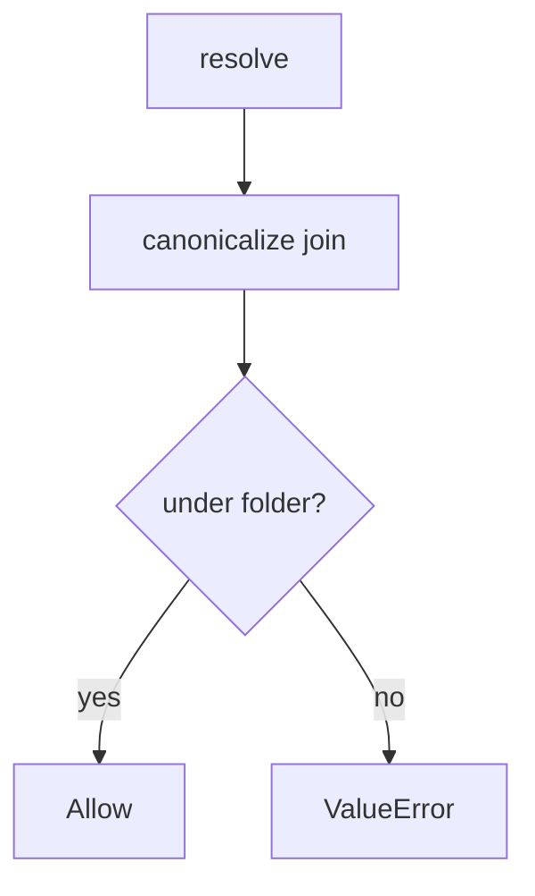

# Canonicalize, then require the lab prefix

**Kind:** design-exercise
**Loop step:** 4 Build

## The rule

`resolve` must join, canonicalize, and deny unless the result is the folder or a child of `/tmp/sc-lab`. Here: that prefix check — not a denylist of `..`, not a UUID filename sticker, not trusting `Content-Type`.

For uploads: deny if not under the folder. If canonicalize is uncertain, **deny**. A name that “looks like notes/a.txt.” is not a canonical path.

## Picture: deny if not under the folder



`resolve` uses `(ROOT / name)` and raises `ValueError("escape")` unless `ROOT` is `p` or in `p.parents`. Internally generated names remain extra defense. Zip member paths are another parser of the same rule. XML/pickle/YAML are leftover of the earlier data-vs-grammar shape, not this prefix.

User filenames still need a hard check — `resolve`.

## What the repaired files must show

| After the fix | Must be true |
|---|---|
| honest `notes/a.txt` | under `/tmp/sc-lab` |
| `../outside` | `ValueError` (or not under the folder) |

## What this is not

A blacklist of `..` only. Trusting `Content-Type`. Running uploads as code. Unpacking zip members with user paths. UUID rename without a prefix test. Antivirus as the object check.

## What can still go wrong

- Zip members that still use user paths inside archives (later, harder leftover).
- Magic-byte vs extension is a different rule.
- Uploads run as server code if you later serve from an interpreted directory.
- Image codecs wait for a later elective.
- XML entity expansion / pickle / YAML `load` are other parsers (same earlier shape).
- Encodings that defeat a `..` denylist.

## Practice

Name who (uploader), what (file under the folder), action (`resolve`), and the check (canonical path is the folder or a child). Run:

```text
python3 -m pytest labs/6.4/6.4-lab/tests --impl fixed
```

Do not `open()` a path outside the lab folder.

## Use it somewhere new

Stop joining the original scan filename onto a public folder; canonicalize then prefix.

## What this page is not doing

Do not hunt host files. Do not treat a UUID filename as a finished check-in.
