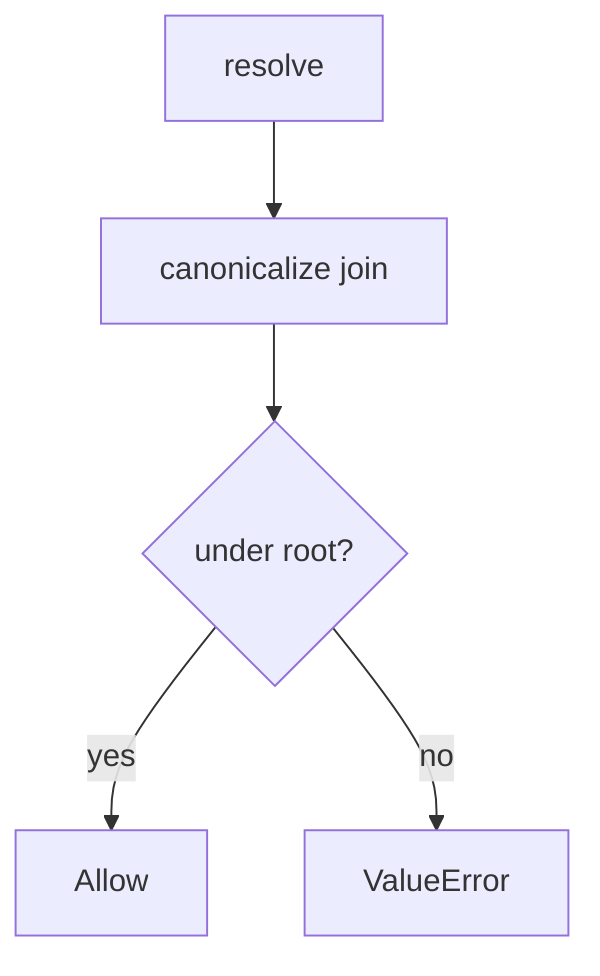

# 6.4-LO-04 — Canonicalize, then require the lab prefix

**Kind:** design-exercise
**Loop step:** 4 Build
**Standards:** OWASP ASVS 5.0.0 (final) `v5.0.0-5.3.2`. `v5.0.0-5.3.3` is **Level 3, advanced**. `v5.0.0-5.3.1` (not executed as code) is a named residual.

## Structural means the object is inside the root

`resolve` must join, canonicalize, and deny unless the result is the root or a child of `/tmp/sc-lab`. Structural means that prefix check — not a denylist of `..`, not a UUID filename sticker, not trusting `Content-Type`.

The smallest restore for SecureCollab Phase 1 uploads is: deny if not under root. Fail-safe: if canonicalize is uncertain, **deny**. Do not fail open because the name “looks like notes/a.txt.”

## Mental model: deny if not under root



The lab’s fixed tree resolves `(ROOT / name)` and raises `ValueError("escape")` unless `ROOT` is `p` or in `p.parents`. Production still needs internally generated names (`v5.0.0-5.3.2`) as defense in depth. Zip member paths (`v5.0.0-5.3.3` Level 3) are another parser of the same cell. XML/pickle/YAML are 6.1-shaped residuals, not this prefix.

ASVS `v5.0.0-5.3.2` wants path validation. This pytest is that sentence for `resolve`.

## Why this restores the cell

| After the fix | Must be true |
|---|---|
| honest `notes/a.txt` | under `/tmp/sc-lab` |
| `../outside` | `ValueError` (or not under root) |

## What this is not

Blacklist of `..` only. Trusting `Content-Type`. Executing uploads. Unpacking zip members with user paths. UUID rename without a prefix test. Antivirus as the object check.

## Mechanism limits

- Zip slip (`v5.0.0-5.3.3` Level 3 advanced) still uses user paths inside archives.
- Magic-byte vs extension (`v5.0.0-5.2.2`) is a different cell.
- Uploads executed as server code (`v5.0.0-5.3.1`) if you later serve from an interpreted directory.
- Image codecs wait for E4.
- XML entity expansion / pickle / YAML `load` are other parsers (6.1 shape).

## Practice

Name the predicate (canonical path is root or child). Run:

```text
python3 -m pytest labs/6.4/6.4-lab/tests --impl fixed
```

Must pass. Do not `open()` a path outside the lab root.

## Transfer

Clinic: stop joining the original scan filename onto a public folder; canonicalize then prefix.

## Residual risk

Zip slip Level 3; XML/pickle; image codecs (E4); executing uploads; encodings that defeat a `..` denylist.

## Non-goals

Do not trophy host files. Do not claim Gate 6 from a UUID filename.
