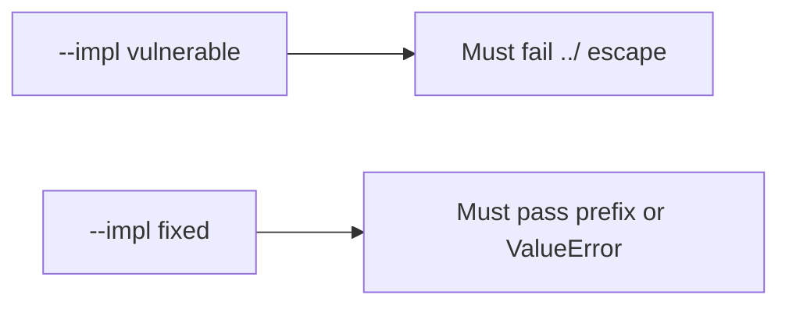

# 6.4-LO-05 — Evidence is a prefix, then a passing pair

**Kind:** verification-lab
**Loop step:** 5 Verify
**Standards:** OWASP ASVS 5.0.0 (final) `v5.0.0-5.3.2`.

## An invariant that cannot fail a test is still a slogan

“We use UUID names” is not evidence. “We strip `..`” is a mechanism observation. The oracle is: `resolve("../outside")` raises `ValueError` **or** the canonical path is still `/tmp/sc-lab` or a child. That observation must be **false** on `--impl vulnerable` (join escapes) and **true** on `--impl fixed`. Tests must not read host files outside the lab root.

## Mental model: vulnerable must fail: ../ escape

The failing observation on `--impl vulnerable` is **../ escape**. A passing collection count is not this cell.



| Mode | Must show for this module |
|---|---|
| Normal | honest `notes/a.txt` stays under the root (may pass on both) |
| Negative / abuse | `../outside` does not leave the root; vulnerable must fail |
| Not claimed | zip members; XML entities; pickle; live host reads |

Lab tests in `labs/6.4/6.4-lab/tests/test_property.py`. `test_dotdot_does_not_escape_root` is a **forbidden-outcome** test: an escaped object is not allowed to count as a passing control. The name `../outside` is data for the prefix check — not a cookbook for other directories.

```text
python3 -m pytest labs/6.4/6.4-lab/tests --impl vulnerable
python3 -m pytest labs/6.4/6.4-lab/tests --impl fixed
```

Honest relative names may pass on both implementations. That does not excuse the escape test. If vulnerable does not fail the prefix assertion, the lab is miswired—fix the wiring, not the assertion.

## What the tests do not prove

- Zip slip (`v5.0.0-5.3.3` Level 3)
- Magic-byte vs extension (`v5.0.0-5.2.2`)
- Uploads not executed (`v5.0.0-5.3.1`) except as a named residual
- Antivirus (`v5.0.0-5.4.3`) — extra, not the property
- XML/pickle/YAML parsers

Record those as residuals or later modules, not as silent passes.

## Practice

Execute both implementations this session. Write the fail/pass pair next to the matrix row. Reject a “test” that only greps `uuid` in a filename helper without calling `resolve("../outside")`.

## Transfer

Clinic scan filename. A test that only asserts HTTP 200 on upload is not this cell (see 9.3). A test that opens host files outside the lab root is out of scope.

## Non-goals

Do not add a host-file trophy. Do not log original filenames if they are patient ids. Keys stay out of this file.
