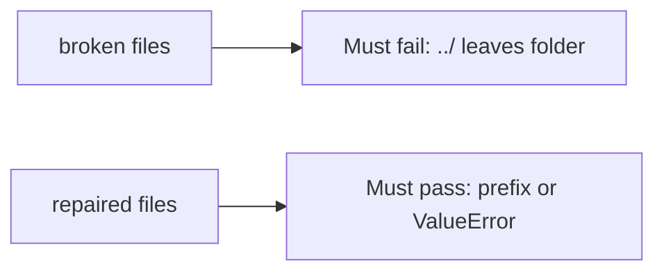

# Fail on the broken files, then pass on the repaired ones

**Kind:** verification-lab
**Loop step:** 5 Verify

## If you cannot test it, it is still a slogan

“We use UUID names” is not this topic’s evidence. “We strip `..`” is a tool observation. The check is: `resolve("../outside")` raises `ValueError` **or** the canonical path is still `/tmp/sc-lab` or a child. That observation must be **false** on the broken files (join leaves the folder) and **true** on the repaired files. Tests must not read host files outside the lab folder.

## Picture: a path that leaves the folder must fail

A test that only greps `uuid` in a filename helper can pass while `resolve("../outside")` still leaves the folder. This check asks whether an escaped object still counts as a passing control. Broken must fail that question. Repaired must pass it.



| Mode | Must show for this topic |
|---|---|
| Normal | Honest `notes/a.txt` stays under the folder (may pass on both) |
| Wrong input / abuse | `../outside` does not leave the folder; broken files must fail |
| When things break | If canonicalize is uncertain, deny (write it as leftover if this pytest does not cover it) |
| Not claimed | Zip members; XML entities; pickle; live host reads; awareness-list “compliant” |

Lab tests: `test_dotdot_does_not_escape_root` and `test_honest_relative_stays_under_root` in `labs/6.4/6.4-lab/tests/test_property.py`. The first test is a **what-must-not-happen** test: an escaped object is not allowed to count as a passing control. The name `../outside` is data for the prefix check — not a cookbook for other directories.

```text
python3 -m pytest labs/6.4/6.4-lab/tests --impl vulnerable
python3 -m pytest labs/6.4/6.4-lab/tests --impl fixed
```

Honest relative names may pass on both implementations. That does not excuse the escape test. Map each test to the prefix row you wrote on the map page. If the broken files do not fail the prefix check, the lab is miswired — fix the wiring, not the check. An environment error is not security evidence.

## What the tests do not prove

- Zip members that walk out
- Magic-byte vs extension
- Uploads not run as code, except as leftover you name
- Antivirus — extra, not the rule
- XML/pickle/YAML parsers

Record those as leftover or later topics, not as silent passes.

## Practice

Run both this session. Write the fail/pass pair next to the matrix row. Reject a “test” that only greps `uuid` in a filename helper without calling `resolve("../outside")`.

## Use it somewhere new

Clinic scan filename. A test that only asserts HTTP 200 on upload is not this cell. A test that opens host files outside the lab folder is out of scope.

## What this page is not doing

Do not add a host-file trophy. Do not log original filenames if they are patient ids. Answer keys are not on this site.
