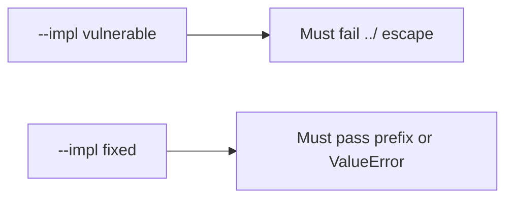

# 6.4-LO-05 — Evidence is a prefix, then a passing pair

**Kind:** verification-lab
**Loop step:** 5 Verify
**Standards:** OWASP ASVS 5.0.0 (final) `v5.0.0-5.3.2`.

## An invariant that cannot fail a test is still a slogan

“We use UUID names” is not evidence. The oracle is the local pair.

## Mental model: vulnerable must fail: ../ escape

The failing observation on `--impl vulnerable` is **../ escape**. A passing collection count is not this cell.



| Case | Must show |
|---|---|
| Negative / abuse | `../outside` does not leave the root |
| Normal | honest `notes/a.txt` stays under the root |
| Not claimed | zip members; XML entities; pickle; live host reads |

```
python3 -m pytest labs/6.4/6.4-lab/tests --impl vulnerable
python3 -m pytest labs/6.4/6.4-lab/tests --impl fixed
```

Honest relative names may pass on both.

## What the tests do not prove

- Zip slip (`v5.0.0-5.3.3` Level 3)
- Magic-byte vs extension (`v5.0.0-5.2.2`)
- Uploads not executed (`v5.0.0-5.3.1`) except as a named residual
- Antivirus (`v5.0.0-5.4.3`) — extra, not the property

## Practice

Execute both implementations. Map each test to an LO-02 cell.

## Transfer

Clinic scan filename. A test that only asserts HTTP 200 on upload is not this cell.
