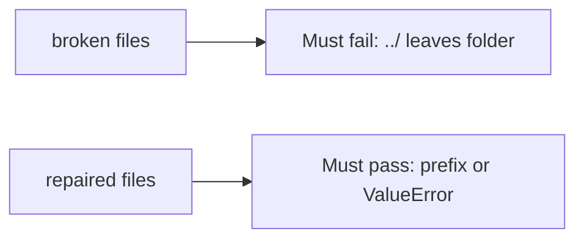

# A path that leaves the folder must fail

**Kind:** verification-lab
**Loop step:** 5 Verify

## Check it

UUID filenames do not keep `../` inside the folder. Stripping `..` in one place is a string munge. `resolve("../outside")` has to raise `ValueError` **or** stay under `/tmp/sc-lab`. Broken: join leaves the folder. Repair keeps `../outside` under the lab root, or raises. Tests must not read host files outside the lab folder.

## Picture: a path that leaves the folder must fail

A grep for `uuid` in a filename helper can still hide that `resolve("../outside")` still leaves the folder.



| Mode | Must show for this topic |
|---|---|
| Normal | Honest `notes/a.txt` stays under the folder (may pass on both) |
| Wrong input / abuse | `../outside` does not leave the folder; broken files must fail |
| When things break | If canonicalize is uncertain, deny (write it as leftover if this check does not cover it) |
| Not claimed | Zip members; XML entities; pickle; live host reads; awareness-list “compliant” |

Lab tests: `test_dotdot_does_not_escape_root` and `test_honest_relative_stays_under_root` in `labs/6.4/6.4-lab/tests/test_property.py`. The first test is there so an escaped object still fails. The name `../outside` is data for the prefix check — not a cookbook for other directories.

```text
python3 -m pytest labs/6.4/6.4-lab/tests --impl vulnerable
python3 -m pytest labs/6.4/6.4-lab/tests --impl fixed
```

Keep a relative name under the lab folder. Stop `../` from leaving it. Map each test to the prefix row you wrote on the map page. If the broken files do not fail the prefix check, the lab is miswired — fix the wiring, not the check. A setup error is not proof the rule holds.

## What the tests do not prove

- Zip members that walk out
- Magic-byte vs extension
- Uploads not run as code, except as leftover you name
- Antivirus — extra, not the rule
- XML/pickle/YAML parsers

## Practice

Call `resolve("../outside")`. A `uuid` in a filename helper is the name scheme, not the folder.

## Use it somewhere new

A 200 from a scan upload does not prove `../` stayed in the folder. Do not run a test that opens host files outside the lab folder.

## What this page is not doing

A host-file screenshot is not `../` staying in the folder. Do not log original filenames if they are patient ids. Answer keys are not on this site.
