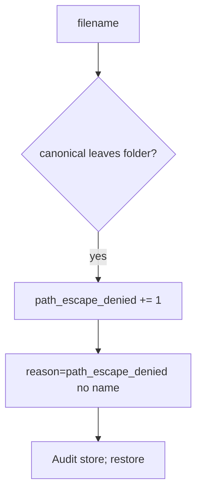

# Notice path_escape_denied

**Kind:** operations-exercise
**Loop step:** 6 Operate

## Fixing it once is not enough

A new export path can join a user filename again after `resolve` was “fixed once.” Do not log original filenames if they are patient ids. Do not paste host paths into the ticket.

## Picture: an escape attempt is a signal



A broken resolve is something you still have to notice and recover from, not an excuse to dump a patient filename into the log.

| Outcome | This topic |
|---|---|
| Notice | `path_escape_denied` |
| What the line holds | request id, stored key; never the raw filename if it is a patient id |
| Recover | Deny; audit; restore if a file landed outside |
| Leftover | Malware scan extra; zip/XML still open |

A log product and an antivirus name do not prove this path rule. Re-run `test_dotdot_does_not_escape_root` after any upload helper change; a green “UUID filenames” tile is not that check. Export and unzip paths are other parsers of the same rule — inventory them before claiming recover.

Recovery is incomplete if the next route still joins `UploadFile.filename` without canonicalize. Grep export and unzip helpers the same day you restore a stray file, or the next scan re-issues the escape.

## What the framework does vs what you still have to check

A WAF will page on `../` in the URL and stay silent when `UploadFile.filename` still joins without canonicalize. Notice must observe **canonical path left the folder**, not a denylist hit. If the alert includes a patient filename or a host path cookbook, you have opened a leak.

## Practice

```text
log_denied reason=path_escape_denied request_id=req_64p
```

Reject any line that includes a patient filename, a note body, or a host path cookbook.

## Use it somewhere new

A clinic example: notice scan names that leave the imaging root; do not paste filenames into the ticket. Do not open a live imaging folder.

## What this page is not doing

Naming an antivirus product is not the rule. Do not use live host reads are out of scope. This page does not finish a check-in. Answer keys are not on this site.
