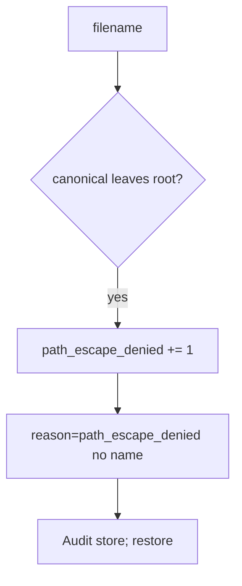

# 6.4-LO-06 — Detect path_escape_denied

**Kind:** operations-exercise
**Loop step:** 6 Operate
**Standards:** NIST CSF 2.0 (final) DE/RS/RC as outcome labels; OWASP ASVS 5.0.0 (final) `v5.0.0-5.3.2`. CSF names outcomes; it does not canonicalize paths.

## Prevention is not absolute

A new export path can join a user filename again after `resolve` was “fixed once.” Pair detect and recover. Do not log original filenames if they are patient ids. Do not paste host paths into the ticket.

## Mental model: escape attempt is a signal



| Outcome | This module |
|---|---|
| Detect | `path_escape_denied` |
| Signal | request id, stored key; never the raw filename if PHI |
| Recover | Deny; audit; restore if a file landed outside |
| Residual | Malware scan extra; zip/XML still open |

CSF 2.0 Detect / Respond / Recover name outcomes. They do not prove `v5.0.0-5.3.2`. An AV product name is not the property. Re-run `test_dotdot_does_not_escape_root` after any upload helper change; a green “UUID filenames” tile is not that pytest. Export and unzip paths are other parsers of the same cell — inventory them before claiming Recover.

Recovery is incomplete if the next route still joins `UploadFile.filename` without canonicalize. Grep export and unzip helpers the same day you restore a stray file, or the next scan re-issues the escape.

## Framework defaults versus the operate guarantee

A WAF will page on `../` in the URL and stay silent when `UploadFile.filename` still joins without canonicalize. Detection must observe **canonical path left the root**, not a denylist hit. If the alert includes a patient filename or a host path cookbook, you have opened a 3.1 / 5.1 cell.

## Practice

Write one log line you would accept. Tie it to `labs/6.4/6.4-lab`.

```text
log_denied reason=path_escape_denied request_id=req_64p
```

Reject any line that includes a patient filename, a note body, or a host path cookbook.

## Transfer

Clinic: detect scan names that leave the imaging root; do not paste filenames into the ticket. Do not open a live imaging folder.

## Non-goals

An AV product name is not the property. Live host reads are out of scope. Gates 0–10 stay not-attempted.
