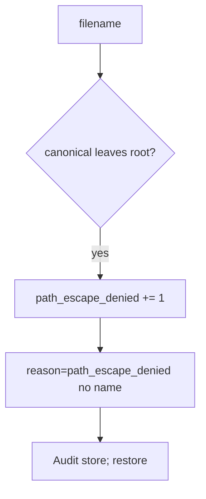

# 6.4-LO-06 — Detect path_escape_denied

**Kind:** operations-exercise
**Loop step:** 6 Operate
**Standards:** NIST CSF 2.0 (final) DE/RS/RC as outcome labels; OWASP ASVS 5.0.0 (final) `v5.0.0-5.3.2`.

## Prevention is not absolute

A new export path can join a user filename again. Pair detect and recover. Do not log original filenames if they are patient ids.

## Mental model: escape attempt is a signal



| Outcome | This module |
|---|---|
| Detect | `path_escape_denied` |
| Signal | request id, stored key; never the raw filename if PHI |
| Recover | Deny; audit; restore if a file landed outside |
| Residual | Malware scan extra; zip/XML still open |

## Practice

Write one log line you would accept. Tie it to `labs/6.4/6.4-lab`.

```
log_denied reason=path_escape_denied request_id=req_64p
```

Reject any line that includes a patient filename, a note body, or a host path cookbook.

## Transfer

Clinic: detect scan names that leave the imaging root; do not paste filenames into the ticket.

## Non-goals

An AV product name is not the property.
