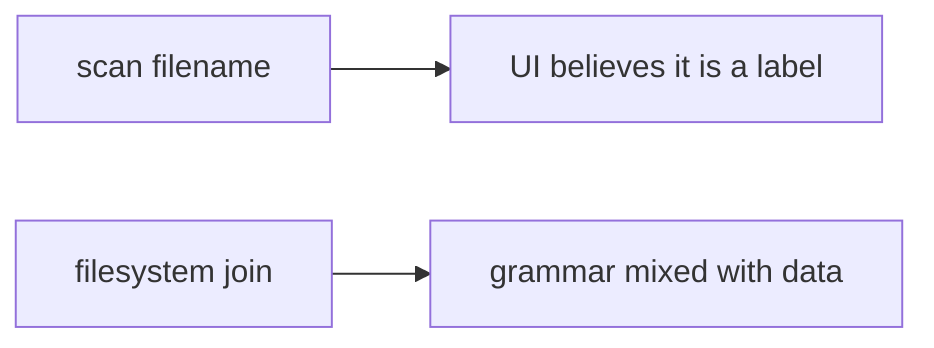

# 6.4-LO-07 — Transfer: clinic scan upload

**Kind:** transfer-challenge
**Loop step:** 7 Transfer
**Standards:** OWASP ASVS 5.0.0 (final) `v5.0.0-5.3.2`. Zip slip is Level 3 advanced.

## Change the workplace; keep prefix-after-canonicalize

Do not answer with a Top 10 / CWE / scanner as the definition of security. The SecureCollab sentence was: `resolve` must not return a path outside `/tmp/sc-lab`. Rewrite it for a clinic without changing the fork.

**Prompt:** Clinic scan upload whose original filename is kept. Also name XML entity expansion, pickle, and YAML load as other parsers (same 6.1 shape).

**Product sketch:** EHR-lite “attach imaging” that joins the filename onto a public folder.

Rewrite the SecureCollab sentence. Include:

1. attacker capabilities (patient or device supplying a filename — not a live clinic);
2. trust assumptions (canonical prefix is TCB; UUID sticker is not);
3. forbidden outcome (`resolve` leaves the imaging root, not “HIPAA”);
4. a test idea on a **local** fixture only (prefix, no host-file trophy);
5. residual (zip members Level 3; XML/pickle; codecs E4; executing uploads);
6. WCAG if a human “upload rejected” path is in the claim (readable error, not a silent missing image).

## Mental model: the scan filename is still a path parser input

If the original scan filename is joined onto a public folder without canonicalize-and-prefix, the cell is gone. FastAPI, a UUID rename, and an AV scanner do not bind the object. Zip member paths are `v5.0.0-5.3.3` Level 3 — same shape, different parser. XML/pickle/YAML `load` are 6.1-shaped residuals: name them, do not run those parsers here.

The clinic rewrite still has to keep the SecureCollab fork: after join and canonicalize, the object is still the imaging root or a child. Randomizing filenames without a prefix test leaves `../` encodings live. The local pytest analogue is `test_dotdot_does_not_escape_root` — on a fixture, not a live imaging store.

## What graders reject

| Reject | Why |
|---|---|
| “We renamed to UUID” | Extra, not the prefix check |
| Live clinic probe | Lab policy |
| Zip-bomb cookbook | Lab policy |
| HTTP 200 as object evidence | Wrong observation |
| Content-Type as the path check | Wrong parser |

## Practice

One page. No keys. `labs/6.4/6.4-lab` is the only running system you may break. Do not open host files outside the lab root.

## Non-goals

Live-target path trophies. Real patient filenames. Claiming Gate 6 from this page.
