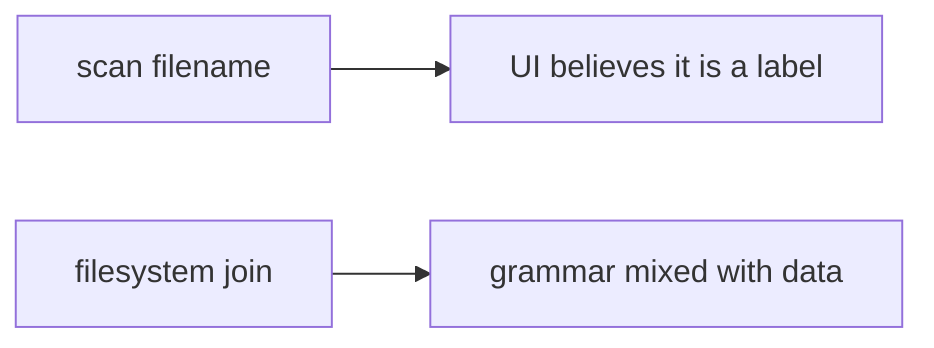

# 6.4-LO-07 — Transfer: clinic scan upload

**Kind:** transfer-challenge
**Loop step:** 7 Transfer
**Standards:** OWASP ASVS 5.0.0 (final) `v5.0.0-5.3.2`. Zip slip is Level 3 advanced.

## Change the workplace; keep prefix-after-canonicalize

Do not answer with a Top 10 / CWE / scanner as the definition of security.

**Prompt:** Clinic scan upload whose original filename is kept. Also name XML entity expansion, pickle, and YAML load as other parsers (same 6.1 shape).

**Product sketch:** EHR-lite “attach imaging” that joins the filename onto a public folder.

Rewrite the SecureCollab sentence. Include:

1. attacker capabilities (patient or device supplying a filename — not a live clinic);
2. trust assumptions (canonical prefix is TCB; UUID sticker is not);
3. forbidden outcome (`resolve` leaves the imaging root, not “HIPAA”);
4. a test idea on a **local** fixture only (prefix, no host-file trophy);
5. residual (zip members Level 3; XML/pickle; codecs E4; executing uploads);
6. WCAG if a human “upload rejected” path is in the claim (readable error, not a silent missing image).

## Mental model: the scan filename is still a path parser input

## What graders reject

| Reject | Why |
|---|---|
| “We renamed to UUID” | Extra, not the prefix check |
| Live clinic probe | Lab policy |
| Zip-bomb cookbook | Lab policy |

## Practice

One page. No keys. `labs/6.4/6.4-lab` is the only running system you may break.
