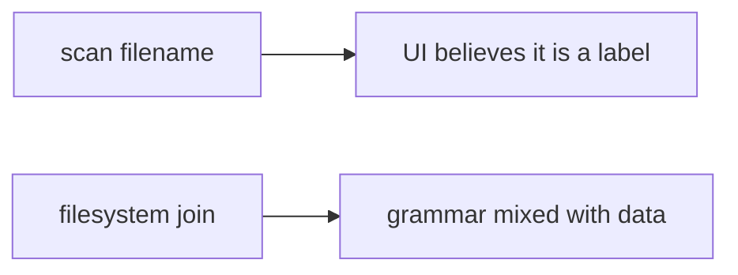

# Same idea on a clinic scan upload

**Kind:** transfer-challenge
**Loop step:** 7 Transfer

## Use it somewhere new

You get a **clinic scan upload** whose original filename is kept. On the notes app, `resolve` must not return a path outside `/tmp/sc-lab`.

**Prompt:** Clinic scan upload whose original filename is kept. Also name XML entity expansion, pickle, and YAML load as other parsers (same earlier data-vs-grammar shape).

**Product sketch:** EHR-lite “attach imaging” that joins the filename onto a public folder.

1. who can act (patient or device supplying a filename — **not** a live clinic);
2. what you trust (canonical prefix is what you trust; a UUID sticker is not);
3. what must not happen (`resolve` leaves the imaging root — not a privacy-law name);
4. a test idea on a **local** practice only (prefix, no host-file trophy);
5. leftover (zip members, later and harder; XML/pickle; image codecs later; running uploads as code);
6. whether a human “upload rejected” path must meet the web accessibility baseline (readable error, not a silent missing image).

## Picture: the scan filename is still a path parser input

Renaming “notes upload” to “scan upload” is not transfer. FastAPI, a UUID rename, and an antivirus scanner still do not bind the object.

If the original scan filename is joined onto a public folder without canonicalize-and-prefix, the rule is gone. Zip member paths are the same shape, different parser — leftover, later and harder. XML/pickle/YAML `load` are leftover of the earlier shape: name them, do not run those parsers here.

After join and canonicalize, the object is still the imaging root or a child. Randomizing filenames without a prefix test leaves `../` encodings live. The local check is `test_dotdot_does_not_escape_root` — on a practice, not a live imaging store.

User filenames still need a hard check. That is the clinic transfer. Neither sentence is an awareness-list name.

## What is not good enough

| Reject | Why |
|---|---|
| “We renamed to UUID” | Extra, not the prefix check |
| Live clinic probe | Course rules |
| Zip-bomb cookbook | Course rules |
| HTTP 200 as object evidence | Wrong observation |
| Content-Type as the path check | Wrong parser |
| An awareness-list name as the rule | Awareness only |

## Practice

One page. No keys. `labs/6.4/6.4-lab` is the only running system you may break. Do not open host files outside the lab folder. Do not fetch a live imaging folder, a classmate preview, or a public upload API.

## What this page is not doing

Live-target path trophies. Real patient filenames. This page does not finish a check-in.
