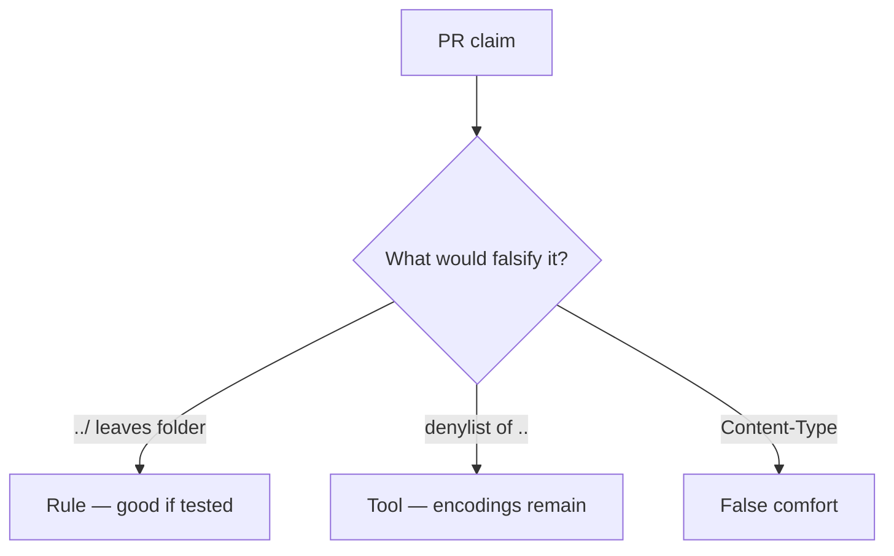

# Review of join-without-canonicalize

**Kind:** code-review
**Loop step:** Review

Intended findings live only in the answer-key folder — not here. Do not open that file until your review has been evaluated.

## What you are reviewing

A colleague ships notes-app uploads. Review `labs/6.4/6.4-lab/vulnerable/` as that change. Your job is not to count suspicious lines. Reconstruct whether `resolve("../outside")` still leaves `/tmp/sc-lab`, compare that with the rule, and write changes a developer can verify.

The check you already ran (`test_dotdot_does_not_escape_root`) is the rule test. A comment “will canonicalize later” is not.

## Picture: open(user_path) / join without canonicalize

Start with this seeded smell: **`open(user_path)` / join without canonicalize**. Label it rule, tool, or false comfort before you accept the change.

Hold onto canonical object still under the folder. If that call is missing join-canonicalize-prefix, you still have a leftover path. A `..` denylist without a prefix test is still the same problem.

Zip member paths are another parser of this rule, not a reason to skip `test_dotdot_does_not_escape_root`. Starlette `UploadFile.filename` is still client data after the change “randomizes names.”

## Problems to find (name them yourself)

- `open(user_path)` / join without canonicalize
- Blacklist of `..` only
- Trust `Content-Type`
- No prefix test

Also reject: host-file trophies; treating the client as what you trust; an awareness-list name as the finding title; closing findings without re-running `test_dotdot_does_not_escape_root`; keys in learner notes; live walks against a public filesystem.

## Common mix-ups

- UUID filenames replace path checks
- Antivirus is the upload control
- JSON is always a safe deserialize
- An awareness-list name is the rule
- Starlette `UploadFile` already canonicalizes

## Practice

Write three review notes a maintainer could act on. Each note: what you saw, rule or false comfort, suggested structural change, leftover you will **not** delete. Tie at least one to `test_dotdot_does_not_escape_root`. Do not open the keys file.

## Use it somewhere new

Clinic change that “randomized filenames” without a prefix test is an incomplete review. Name the independent falsehood that would still keep `../outside` from leaving the imaging root.

## What this page is not doing

Do not merge by adding a comment “will canonicalize later.” That comment is leftover risk without an owner. Do not open host files to prove the finding.
