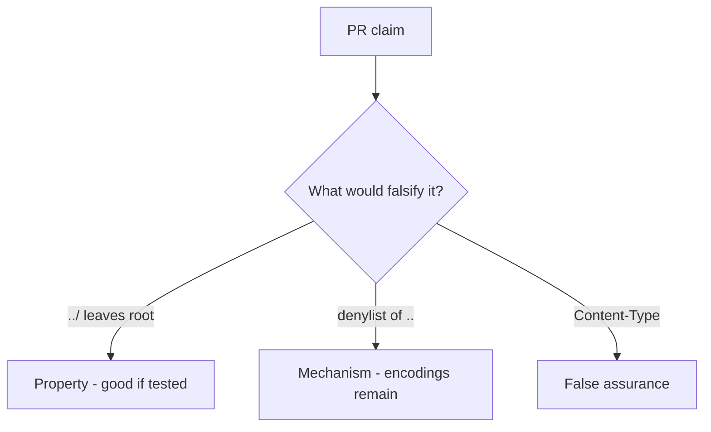

# 6.4-LO-08 — Review join-without-canonicalize as a PR, not a CWE ticket

**Kind:** code-review
**Loop step:** Review
**Standards:** OWASP ASVS 5.0.0 (final) `v5.0.0-5.3.2`.

## Review the fixture as if it were SecureCollab uploads

Review `labs/6.4/6.4-lab/vulnerable/` as a SecureCollab PR. Intended findings live only in `content/assessment/keys/6.4.md` — not here.

## Mental model: open(user_path) / join without canonicalize

Start with this seeded smell: **`open(user_path)` / join without canonicalize**. Label it property, mechanism, or false assurance before you accept the PR.

Seeded smells (label them yourself; do not open the keys file):

- `open(user_path)` / join without canonicalize
- Blacklist of `..` only
- Trust `Content-Type`
- No prefix test

Also reject: host-file trophies, keys in lessons.

## Misconceptions

- UUID filenames replace path checks
- Antivirus is the upload control
- JSON is always safe deserialize

## Practice

Write three review notes. Tie at least one to `test_dotdot_does_not_escape_root`.

## Transfer

Clinic PR that “randomized filenames” without a prefix test is incomplete.
