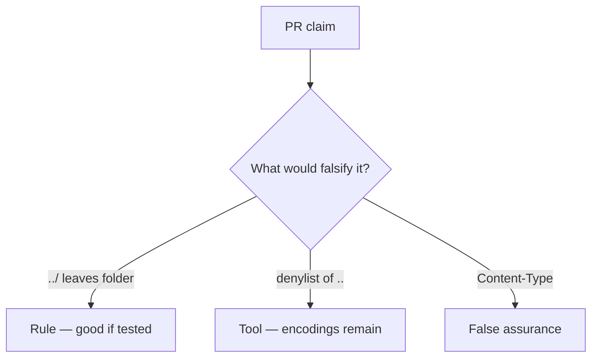

# Review of join-without-canonicalize

**Kind:** code-review
**Loop step:** Review

## What you are reviewing

Review `labs/6.4/6.4-lab/vulnerable/` as a change to notes-app uploads. Check whether `resolve("../outside")` still leaves `/tmp/sc-lab`.

You already ran `test_dotdot_does_not_escape_root` — that is the rule. A comment “will canonicalize later” is not.

## Picture: open(user_path) / join without canonicalize

**`open(user_path)` / join without canonicalize**.

The canonical object still has to stay under the folder. If the change never joins, canonicalizes, and checks the prefix, that leftover path is still open. A `..` denylist without a prefix test is still the same problem.

Zip member paths are another parser of this rule, not a reason to skip `test_dotdot_does_not_escape_root`. Starlette `UploadFile.filename` is still client data after the change “randomizes names.”

## Problems to find (name them yourself)

- `open(user_path)` / join without canonicalize
- Blacklist of `..` only
- Trust `Content-Type`
- No prefix test

Also reject: host-file trophies; treating the client as what you trust; an awareness-list name as the finding title; closing findings without re-running `test_dotdot_does_not_escape_root`; keys in learner notes; live walks against a public filesystem.

## Common mix-ups

- UUID filenames replace path checks
- Antivirus is the upload control
- JSON is always a safe deserialize
- An awareness-list name is the rule
- Starlette `UploadFile` already canonicalizes

## Practice

Write the review that would block this change. Name `test_dotdot_does_not_escape_root`.

## Use it somewhere new

Clinic change that “randomized filenames” without a prefix test is an incomplete review. Name the independent falsehood that would still keep `../outside` from leaving the imaging root.

## What this page is not doing

Do not merge by adding a comment “will canonicalize later.” That comment is leftover risk without an owner. Do not open host files to prove the finding.
