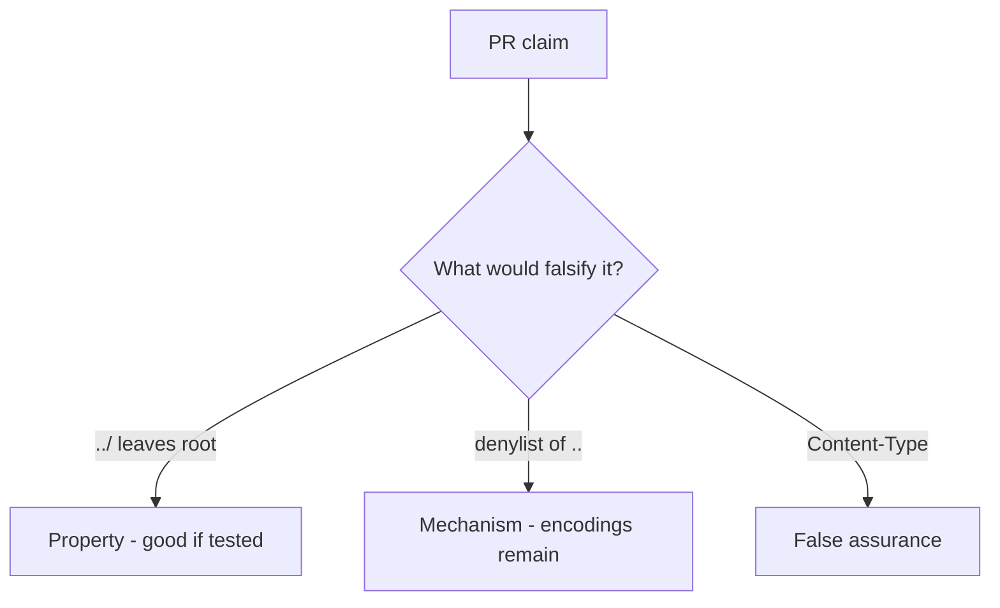

# 6.4-LO-08 — Review join-without-canonicalize as a PR, not a CWE ticket

**Kind:** code-review
**Loop step:** Review
**Standards:** OWASP ASVS 5.0.0 (final) `v5.0.0-5.3.2`.

## Review the fixture as if it were SecureCollab uploads

Review `labs/6.4/6.4-lab/vulnerable/` as a SecureCollab PR. Your job is not to count suspicious lines. Reconstruct whether `resolve("../outside")` still leaves `/tmp/sc-lab`, compare that with the module invariant, and write changes a developer can verify.

Intended findings live only in `content/assessment/keys/6.4.md` — not here. Do not open the keys file until your review has been evaluated.

## Mental model: open(user_path) / join without canonicalize

Start with this seeded smell: **`open(user_path)` / join without canonicalize**. Label it property, mechanism, or false assurance before you accept the PR.

Classification starts at the protected effect (canonical object still under the root). Everything that is not join-canonicalize-prefix at that call is a candidate grammar mix. A `..` denylist without a prefix test is the same smell, not a different finding class.

Zip member paths (`v5.0.0-5.3.3` Level 3) are another parser of this cell, not a reason to skip `test_dotdot_does_not_escape_root`. Starlette `UploadFile.filename` is still client data after the PR “randomizes names.”

## Seeded smells (label them yourself)

- `open(user_path)` / join without canonicalize
- Blacklist of `..` only
- Trust `Content-Type`
- No prefix test

Also reject: host-file trophies; closing findings without re-running `test_dotdot_does_not_escape_root`; keys in lessons.

## Misconceptions this module refuses

- UUID filenames replace path checks
- Antivirus is the upload control
- JSON is always safe deserialize
- CWE-22 is the property
- Starlette `UploadFile` already canonicalizes

## Practice

Write three review notes a maintainer could act on. Each note: observation, property or false assurance, suggested structural change, residual you will **not** delete. Tie at least one to `test_dotdot_does_not_escape_root`.

## Transfer

Clinic PR that “randomized filenames” without a prefix test is an incomplete mediation review. Name the independent falsehood that would still keep `../outside` from leaving the imaging root.

## Non-goals

Do not merge by adding a comment “will canonicalize later.” That comment is a residual without an owner. Do not open host files to prove the finding.
