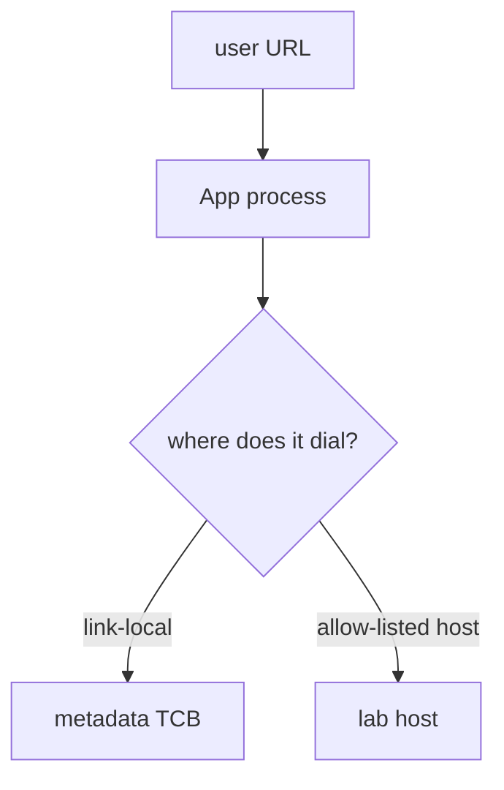
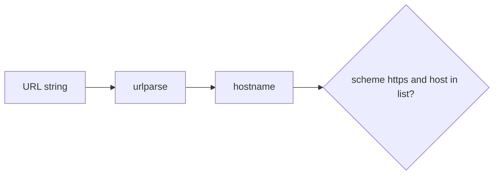

# 6.5-LO-01 — A preview URL is untrusted authority, not a string

**Kind:** concept-model
**Loop step:** 1 Property
**Standards:** OWASP ASVS 5.0.0 (final) `v5.0.0-1.3.6`, `v5.0.0-13.2.4`, `v5.0.0-3.7.2`; `v5.0.0-3.7.3` is **Level 3, advanced**. API7 is *awareness after* the cause. `requests.get` is not this sentence.

## The claim this module owns

SecureCollab Phase 1 may unfurl a link for a note preview. The **URL is untrusted structure** (2.1). The server’s network is not the user’s to steer. Link-local metadata is a forbidden destination.

> `allowed` must be false for a link-local metadata URL. HTTPS to `lab.securecollab.test` may be true. This lab asserts the predicate only. It does not fetch.

The forbidden outcome is **a server-side fetch to link-local metadata allowed**. That is a 1.1 confidentiality failure of the cloud TCB in real systems; here the test fails closed on the string.

ASVS `v5.0.0-1.3.6` wants an allow-list of protocols, domains, paths, and ports before calling another service. `v5.0.0-13.2.4` wants an outbound allow-list. `v5.0.0-3.7.2` wants open redirects onto an allow-list. `v5.0.0-3.7.3` (notify the user on external redirect) is **Level 3, advanced**.

## Mental model: the server is the deputy



The attacker supplies an unfurl URL. Trust is local `allowed(url)`. Do not probe cloud metadata, loopback services, or public hosts.

**Mechanism (not the property):** “HTTPS only” as a string prefix, a WAF, or `requests` timeouts.

## Mental model: parse, then pin the authority



A regex on the raw string still loses to encodings (2.1), decimal IPs, IPv6, and redirects.

## Root cause vs impact vs prevention vs detection vs recovery

| Slice | For this property |
|---|---|
| Root cause | Server fetches attacker-chosen authority |
| Preconditions | `allowed(link-local)` is true |
| Trigger | User-supplied preview URL |
| Impact | Confidentiality of cloud TCB; integrity of egress |
| Prevention | Parse then allow-list; block link-local/loopback; no open redirects |
| Detection | `egress_denied` |
| Recovery | Never rotate a real instance role in this course |

## Framework defaults versus the egress guarantee

`requests.get` is not an allow-list. urllib follows redirects unless you stop it. HTTPS to an IP is still the server’s network.

## Mechanism limits

- DNS rebinding after allow — pin IP or use a dedicated egress proxy (named residual).
- `file:` scheme, IPv6, decimal IPs, redirect off the list.
- Open redirect of the *browser* is `v5.0.0-3.7.2`, a sibling cell.
- Request desynchronization / cache-key confusion wait for hop work (2.2).

## Practice

Parse scheme and host; do not regex the string only. Then run:

```
python3 -m pytest labs/6.5/6.5-lab/tests --impl vulnerable
python3 -m pytest labs/6.5/6.5-lab/tests --impl fixed
```

The first command must fail. The second must pass.

## Transfer

Clinic “fetch lab result PDF from URL.” Webhooks (7.3).

## Non-goals

Live metadata fetches, public SSRF, dumping lab Python into notes. Gates 0–10 and milestones M0–M5 stay **not-attempted**. Answer keys are not in this file.
