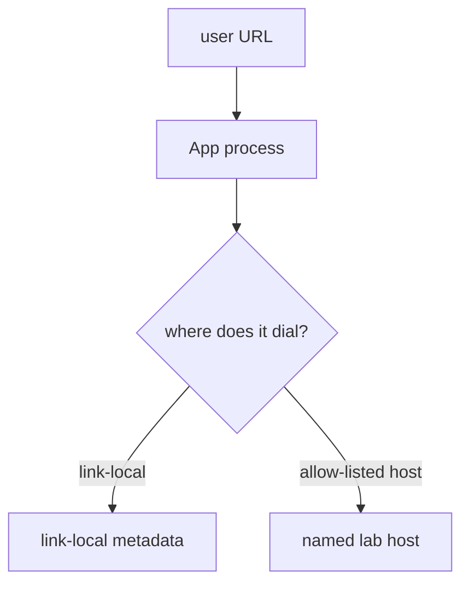
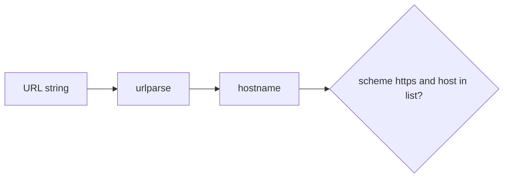

# A preview URL is not permission

**Kind:** concept-model
**Loop step:** 1 Property

## The rule

The notes app may unfurl a link so a note can show a preview. That URL is **untrusted structure** (2.1). It is not permission to use the server’s network. The server’s network is not the user’s to steer. Link-local metadata is a special address a cloud machine uses to ask about itself. It is a forbidden destination.

> `allowed` must be false for a link-local metadata URL. HTTPS to the named lab host may be true. This practice checks the predicate only. It does not fetch.

What must not happen is **a server-side fetch to link-local metadata allowed**. In a real cloud that is a secrecy failure of the machine’s own identity. Here the test fails closed on the string.

Use an allow-list of protocols, hosts, paths, and ports before the server calls another service. Use an outbound allow-list. Open redirects still have to land on an allow-list. Telling the person they are about to leave the site is **advanced** work, not this check. A famous-bugs nickname for server-side requests is awareness after the cause. `requests.get` is not this sentence.

## Picture: the server is the deputy



Picture a member who supplies a preview URL. What you trust: a local `allowed(url)` check. Do not probe cloud metadata, loopback services, or public hosts.

**The tool (not the rule):** “HTTPS only” as a string prefix, a web filter, or `requests` timeouts.

## Picture: parse, then pin the host



A regex on the raw string still loses to encodings (2.1), decimal IPs, IPv6, and redirects. Parse first. Then allow-list **host and scheme**.

## Why it happens, what it costs, how you stop it, how you notice, how you recover

| Slice | For this rule |
|---|---|
| Why it happens | The server would fetch whoever the URL names |
| What's already wrong | `allowed` is true for a link-local metadata URL |
| Trigger | User-supplied preview URL |
| What it costs | Secrecy of cloud identity; integrity of egress |
| How you stop it | Parse, then allow-list host and scheme; block link-local and loopback; do not follow redirects off the list |
| How you notice | `egress_denied` |
| How you recover | Keep the deny; do not rotate a real cloud role as homework |

## What the framework does vs what you still have to check

`requests.get` is not an allow-list. urllib follows redirects unless you stop it. HTTPS to an IP is still the server’s network. FastAPI will dial whoever you pass.

`allowed` is false for link-local metadata — files in `labs/6.5/6.5-lab`. Fake URLs only. No live fetch.

## What the tool cannot do

- DNS rebinding after allow — pin the IP or use a dedicated egress proxy (named leftover).
- `file:` scheme, IPv6, decimal IPs, redirect off the list.
- Open redirect of the *browser* is a sister check, not this check.
- Request splitting and cache-key confusion wait for hop work (2.2).

## Practice

Parse scheme and host. Do not regex the string only. Then run:

```text
python3 -m pytest labs/6.5/6.5-lab/tests --impl vulnerable
python3 -m pytest labs/6.5/6.5-lab/tests --impl fixed
```

## Use it somewhere new

Clinic “fetch lab result PDF from URL.” Webhooks wait for 7.3.

## What this page is not doing

Do not use live metadata fetches, public server-side request hunts, dumping lab Python into notes. This site does not mark you as finished. Answer keys are not on this site.
