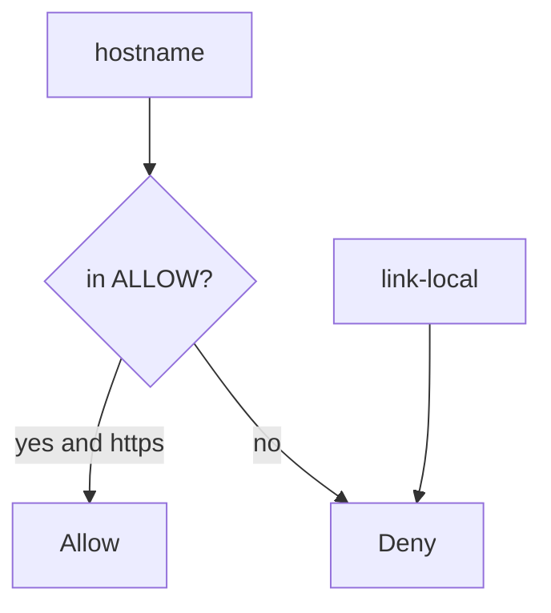
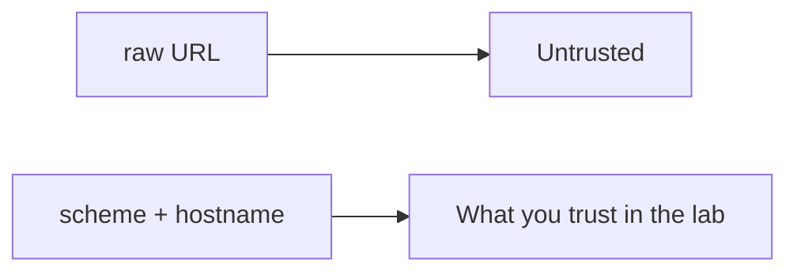

# An egress map someone else can test

**Kind:** design-exercise
**Loop step:** 2 Model

## Could someone else name the checks?

“We only allow HTTPS” is not this lesson. A map someone else can test names **scheme**, **host**, and **destinations that must deny**.

This week’s freeze for the notes app: local `allowed(url)`. No live fetches.

> Parse the URL. Require https. Require the hostname in a small allow-list. Link-local metadata and loopback must deny.

## Picture: allow-list is identity, not a denylist of IPs

Denylists of “private IPs” miss new encodings. The lab host is a **named** peer, not “anything that is not private.”

## Picture: the URL parser is what you trust

Module 2.1 already treated a URL as a structure. Here the structure selects an **egress deputy**: the server fetching on someone else’s behalf.

## Step 1: name the pieces

| Piece | This system |
|---|---|
| Who | member supplying a preview URL |
| What | egress destination |
| Actions | `allowed` |
| Paths | URL string |
| What you trust | parsed https + host allow-list |
| What you do not trust | the full URL |
| Time | one check; DNS later is leftover |
| The rule | secrecy of metadata identity |

## Step 2: write allow and deny

| Who | What | Action | Decision |
|---|---|---|---|
| app | `https://lab.securecollab.test/og` | fetch | allow |
| attacker | link-local metadata URL | fetch | deny |
| attacker | loopback | fetch | deny |
| redirect | off the list | follow | deny (named) |

A missing “link-local metadata × fetch × deny” row is how a scheme-only check appears. Write the hole.

## Practice

Draw parse → host → allow-list so someone else could name the checks. Point at `labs/6.5/6.5-lab` file `ssrf.py`. Fake URLs only. Do not fetch.

## Use it somewhere new

Webhook delivery (7.3). Open redirect of the browser is a sister check.

## What can still go wrong

DNS rebinding; IPv6; `file:`; telling the person they are leaving the site (advanced).

## What this page is not doing

Do not run this map against a live clinic or a live metadata service. Answer keys are not on this site.
