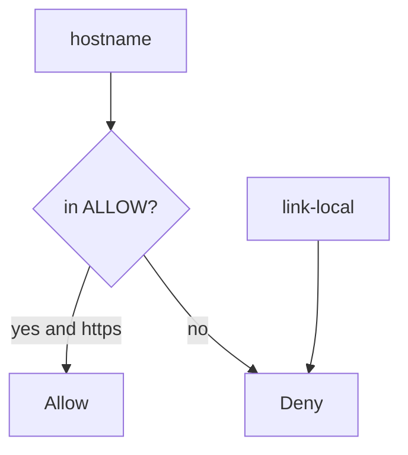
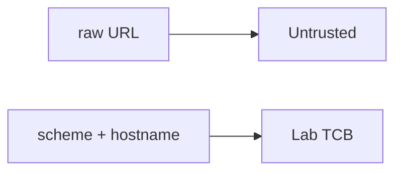

# 6.5-LO-02 — An egress map a second engineer can test

**Kind:** design-exercise
**Loop step:** 2 Model
**Standards:** OWASP ASVS 5.0.0 (final) `v5.0.0-1.3.6`.

## Can a second engineer name pytest cases from your egress map?

“We only allow HTTPS” is not this lesson. A reviewable model names **scheme, host, and destinations that must deny**.

SecureCollab Phase 1 freeze: local `allowed(url)`. No live fetches.

## Mental model: allow-list is identity, not a denylist of IPs

Denylists of “private IPs” miss new encodings. The lab host is a **named** peer.

## Mental model: URL parser is the TCB

Module 2.1 already treated URL as a structure. Here the structure selects an **egress deputy**.

## Step 1: freeze pieces

| Piece | This system |
|---|---|
| Subjects | member supplying a preview URL |
| Objects | egress destination |
| Actions | `allowed` |
| Channels | URL string |
| TCB | parsed https + host allow-list |
| Untrusted | full URL |
| State / time | one check; DNS later is residual |
| 1.1 cell | confidentiality of metadata TCB |

## Step 2: write cells

| Subject | Object | Action | Decision |
|---|---|---|---|
| app | `https://lab.securecollab.test/og` | fetch | allow |
| attacker | link-local metadata URL | fetch | deny |
| attacker | loopback | fetch | deny |
| redirect | off list | follow | deny (named) |

## Practice

Draw parse → host → allow-list. Point at `labs/6.5/6.5-lab` file `ssrf.py`.

## Transfer

Webhook delivery (7.3); open redirect of the browser.

## Residual risk

DNS rebinding; IPv6; `file:`; Level 3 redirect notification.

## Non-goals

Top 10 as the definition of security. Keys stay out of lessons.
