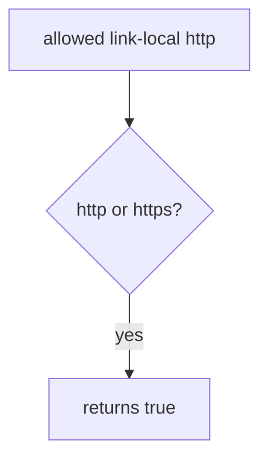

# 6.5-LO-03 — Observe the predicate, do not trophy metadata

**Kind:** mechanism-lab
**Loop step:** 3 Break
**Standards:** OWASP ASVS 5.0.0 (final) `v5.0.0-1.3.6`. `v5.0.0-3.7.3` is **Level 3, advanced**. API7 is awareness after the cause.

## Authorized scope

`labs/6.5/6.5-lab` only. The fixture is an in-process `allowed`. Synthetic URLs. **Do not fetch.** No cloud metadata, no public hosts, no employer PDF importer.

**Forbidden outcome:** server-side fetch to link-local metadata is allowed. `allowed` returns true for a link-local metadata URL.

Attacker capability in this lab: a member who can supply a preview URL (untrusted structure, 2.1). That stands in for a clinic “fetch PDF from URL” field or a webhook target (7.3). Trust assumption: `allowed` is supposed to parse scheme **and** host against a small allow-list. “Starts with https,” a denylist of one IP, and `requests.get` are not in the TCB for this cell.

## Mental model: scheme-only is not an allow-list



The vulnerable tree demonstrates **cause** (server would dial attacker-chosen authority). The link-local address is a **named destination string**. Do not send packets to it. Preconditions: `allowed` returns true for any `http`/`https` scheme. You do not need to `GET`. You must not.

ASVS `v5.0.0-1.3.6` wants an allow-list of protocols, domains, paths, and ports before calling another service. This pytest is the predicate, not a network trophy.

## What to read in the fixture

`vulnerable/ssrf.py` returns true for any `http`/`https` scheme. Tests:

- `test_link_local_metadata_is_denied`
- `test_loopback_is_denied`
- `test_lab_host_https_ok` — honest named host; may pass on vulnerable because any https is true

You do not need a new URL. The failure of `test_link_local_metadata_is_denied` *is* the evidence.

Do not open the fixed tree yet. Diagnose the cause first.

## Root cause vs impact vs prevention vs detection vs recovery

| Slice | This lab |
|---|---|
| Required property | Link-local metadata URL is not an allowed peer |
| Root cause | Server would fetch attacker-chosen authority |
| Preconditions | `allowed` is true for any http/https scheme |
| Trigger | `allowed` on the named link-local metadata URL |
| Impact | Confidentiality of the cloud TCB in real systems; here the predicate fails closed |
| Prevention | Parse; require https; host in ALLOW; deny link-local and loopback |
| Detection | `egress_denied`; never the full URL if it holds secrets |
| Recovery | Keep deny; do not fetch “to confirm” |
| Not the lesson | API7, a live metadata GET, or HTTPS-prefix theater |

## Framework defaults versus the egress guarantee

`requests.get(user_url)` will dial whoever you pass. FastAPI has no outbound allow-list. urllib `urlparse` is not a policy. The application guarantee is: **this** fixture, link-local metadata URL is False. **Do not curl anything.**

## Practice

```text
python3 -m pytest labs/6.5/6.5-lab/tests --impl vulnerable
```

Record `test_link_local_metadata_is_denied`. Do not fetch. An environment error is not security evidence.

## Transfer

Clinic PDF URL. Predict without leaving this directory. Do not fetch a live PDF or metadata endpoint.

## Non-goals

No live-target instructions. Synthetic URLs only. Tests must not fetch.
