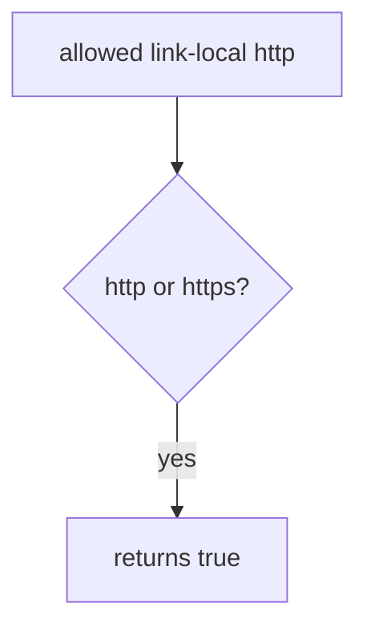

# 6.5-LO-03 — Observe the predicate, do not trophy metadata

**Kind:** mechanism-lab
**Loop step:** 3 Break
**Standards:** OWASP ASVS 5.0.0 (final) `v5.0.0-1.3.6`.

## Authorized scope

`labs/6.5/6.5-lab` only. Synthetic URLs. **Do not fetch.** No cloud metadata, no public hosts.

**Forbidden outcome:** Server-side fetch to link-local metadata is allowed.

## Mental model: scheme-only is not an allow-list



The vulnerable tree demonstrates **cause** (server would dial attacker-chosen authority). The link-local address is a **named destination string**. Do not send packets to it.

## What to read in the fixture

`vulnerable/ssrf.py` returns true for any `http`/`https` scheme. Tests require link-local false, loopback false, and the named lab host on https true.

## Root cause vs impact

| Slice | Lab |
|---|---|
| Root cause | Server fetches attacker-chosen authority |
| Impact | Metadata TCB would be in reach (not fetched here) |
| Not the lesson | API7 as the definition |

## Practice

```
python3 -m pytest labs/6.5/6.5-lab/tests --impl vulnerable
```

Record `test_link_local_metadata_is_denied`. Do not curl anything.

## Transfer

Clinic PDF URL. Predict without leaving this directory.

## Non-goals

No live-target instructions. Synthetic data only.
