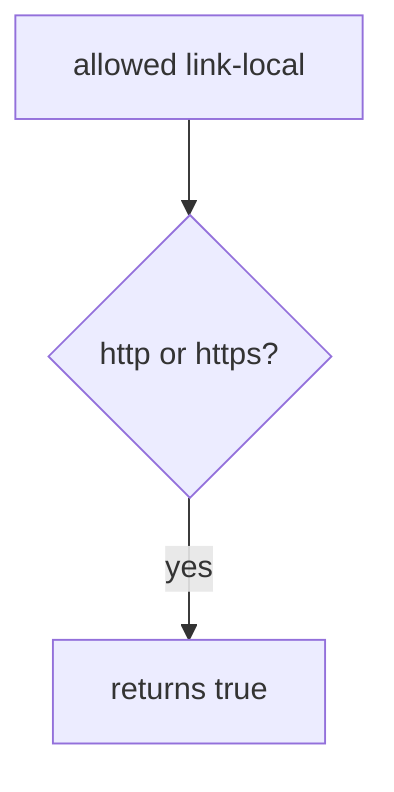

# Practice: a server-side fetch to link-local metadata is allowed

**Kind:** mechanism-lab
**Loop step:** 3 Break

## Try it

The practice is not a website you attack. `allowed` does not open a network. It treats any `http` or `https` scheme as fine, so a link-local metadata URL already counts as an allowed peer. Do not fetch cloud identity.

> A link-local metadata URL is not an allowed peer. `allowed` must be false for that named string. This practice checks the predicate only. It does not fetch.

## Where you may practice

Stay inside `labs/6.5/6.5-lab`. Fake URLs are the inputs to `allowed`. **Do not fetch.** Restore the broken and repaired folders when you are done.

Do not probe cloud metadata. Do not probe public hosts. Do not probe an employer PDF importer. Do not paste a live URL “to see what happens.”

What must not happen: a server-side fetch to link-local metadata is allowed. `allowed` returns true for a link-local metadata URL.

Who could do this: a member who can supply a preview URL (untrusted structure, 2.1). That stands in for a clinic “fetch PDF from URL” field or a webhook target (7.3). What is supposed to stop this: `allowed` parses scheme **and** host against a small allow-list. “Starts with https,” a denylist of one IP, and `requests.get` are not enough.

## Picture: scheme-only is not an allow-list



The server would dial whoever the URL names. The link-local address is a **named destination string**. Do not send packets to it. `allowed` returns true for any `http`/`https` scheme. You do not need a GET. You must not.

Use an allow-list of protocols, hosts, paths, and ports before calling another service. The check is the predicate, not a live fetch. A famous-bugs nickname for server-side requests is awareness after the cause, not that check.

## What to look at: the cause, not a fetch

`vulnerable/ssrf.py` returns true for any `http`/`https` scheme. Tests:

- `test_link_local_metadata_is_denied`
- `test_loopback_is_denied`
- `test_lab_host_https_ok` — honest named host; may pass on the broken files because any https is true

You do not need a new URL.

| What you see | What kind of failure | Not the lesson |
|---|---|---|
| `allowed` true for link-local | Scheme-only check | A live metadata GET |
| loopback also true | Same scheme-only hole | A public hunt |
| named lab host on https | Honest path (may pass on both) | Proof that host was checked |

## Why it happens, what it costs, how you stop it, how you notice, how you recover

| Slice | This practice |
|---|---|
| The rule | Link-local metadata URL is not an allowed peer |
| Why it happens | The server would fetch whoever the URL names |
| What has to be true first | `allowed` is true for any http/https scheme |
| Trigger | `allowed` on the named link-local metadata URL |
| What it costs | Secrecy of cloud identity in real systems; here the predicate fails closed |
| How you stop it | Parse; require https; host in ALLOW; deny link-local and loopback |
| How you notice | `egress_denied`; never the full URL if it holds secrets |
| How you recover | Keep the deny; do not fetch “to confirm” |
| Not the lesson | A famous-bugs nickname, a live metadata GET, or HTTPS-prefix theater |

## What the framework does vs what you still have to check

`requests.get(user_url)` will dial whoever you pass. FastAPI has no outbound allow-list. urllib `urlparse` is not a policy. A link-local metadata URL is False. **Do not curl anything.**

## Practice

```text
python3 -m pytest labs/6.5/6.5-lab/tests --impl vulnerable
```

Do not fetch. A setup error is not proof the rule holds.

## Use it somewhere new

Clinic PDF URL. Predict without leaving this directory. Do not fetch a live PDF or a metadata endpoint.

## What this page is not doing

No live-target instructions. Fake URLs only. Tests must not fetch. Do not “fix” the practice by deleting the test.
