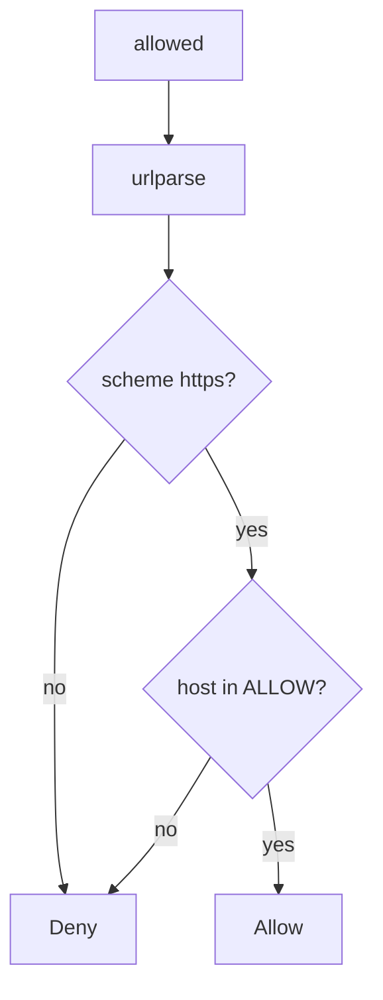

# Parse, then allow-list host and scheme

**Kind:** design-exercise
**Loop step:** 4 Build

## The rule

“Starts with https” is not the fix. A denylist of one IP is not the fix. Following redirects off the list is not the fix.

Structural means the host is a named peer. `allowed` must parse the URL, require `https`, require the hostname in a small allow-list, and deny link-local and loopback.

The smallest restore for notes-app unfurl is: host deny unless listed. Fail closed: unknown host **denies**. Do not fail open because the scheme is https.

## Picture: host deny unless listed



The lab’s repaired files require `https` and host in `{"lab.securecollab.test"}`, and deny named block hosts. Production still needs a dedicated egress proxy if customer sites must be fetched. DNS rebinding and IPv6 encodings remain leftover. Open-redirect UX is a sister check. Telling the person they are leaving the site is advanced work, not this check.

The allow-list has to run before calling another service. This week's check covers `allowed`. **Do not fetch.**

## What the repaired files must show

Read `fixed/ssrf.py` against this checklist. Do not treat the snippet as a production egress proxy.

| After the fix | Must be true |
|---|---|
| link-local metadata URL | false |
| loopback | false |
| `https://lab.securecollab.test/og` | true |

Fail closed: if the host is not on the list, the answer is no. Uncertainty is a **deny**, not a yes because the scheme looked like https.

## What this is not

HTTPS-only regex that still allows a metadata IP. Following redirects off the list. `file:` because the scheme is “local.” Pinning DNS as complete without a proxy. `requests.get` with a timeout as the policy.

## What the tool cannot do

- DNS rebinding can change the IP after the host check unless you pin or proxy.
- IPv6 and decimal encodings of the same destination remain leftover.
- Redirect following can leave the allow-list.
- Webhook signing waits for 7.3.
- `file:` and other schemes must deny, not “local is fine.”

## Practice

Name the check (https ∧ host in ALLOW ∧ not blocked). Run:

```text
python3 -m pytest labs/6.5/6.5-lab/tests --impl fixed
```

Do not fetch the URLs.

## Use it somewhere new

A clinic example: stop fetching whatever URL the form posted; parse then allow-list.

## What can still go wrong

DNS rebinding; IPv6 encodings; telling the person they left the site (advanced); dedicated egress proxy for customer sites.

## What this page is not doing

Do not curl metadata. Do not claim a course gate from an HTTPS prefix.

