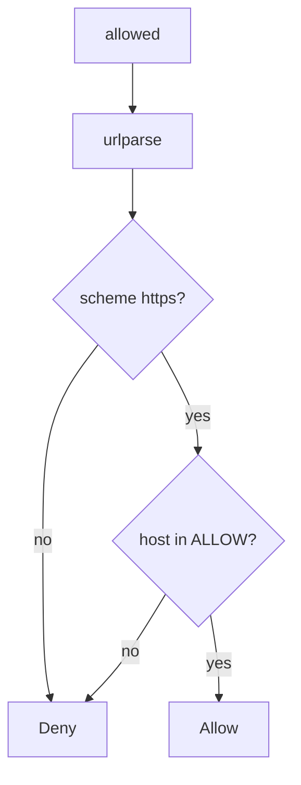

# 6.5-LO-04 — Parse, then allow-list host and scheme

**Kind:** design-exercise
**Loop step:** 4 Build
**Standards:** OWASP ASVS 5.0.0 (final) `v5.0.0-1.3.6` and `v5.0.0-13.2.4`. `v5.0.0-3.7.3` is **Level 3, advanced**.

## Structural means the authority is a named peer

`allowed` must parse the URL, require `https`, require the hostname in a small allow-list, and deny link-local and loopback. Structural means that identity check — not “starts with https”, not a denylist of one IP, not following redirects off the list.

The smallest restore for SecureCollab Phase 1 unfurl is: host deny unless listed. Fail-safe: unknown host **denies**. Do not fail open because the scheme is https.

## Mental model: host deny unless listed



The lab’s fixed tree requires `https` and host in `{"lab.securecollab.test"}`, and denies named block hosts. Production still needs a dedicated egress proxy if customer sites must be fetched. DNS rebinding and IPv6 encodings remain residuals. Open-redirect UX (`v5.0.0-3.7.2`) is a sister cell; user notification (`v5.0.0-3.7.3`) is Level 3 advanced.

ASVS `v5.0.0-1.3.6` wants the allow-list before calling another service. This pytest is that sentence for `allowed`. **Do not fetch.**

## Why this restores the cell

| After the fix | Must be true |
|---|---|
| link-local metadata URL | false |
| loopback | false |
| `https://lab.securecollab.test/og` | true |

## What this is not

HTTPS-only regex that still allows a metadata IP. Following redirects off the list. `file:` because the scheme is “local.” Pinning DNS as complete without a proxy. `requests.get` with a timeout as the policy.

## Mechanism limits

- DNS rebinding can change the IP after the host check unless you pin or proxy.
- IPv6 and decimal encodings of the same destination remain residuals.
- Redirect following can leave the allow-list.
- Webhook signing waits for 7.3.
- `file:` and other schemes must deny, not “local is fine.”

## Practice

Name the predicate (https ∧ host in ALLOW ∧ not blocked). Run:

```text
python3 -m pytest labs/6.5/6.5-lab/tests --impl fixed
```

Must pass. Do not fetch the URLs.

## Transfer

Clinic: stop fetching whatever URL the form posted; parse then allow-list.

## Residual risk

DNS rebinding; IPv6 encodings; Level 3 redirect notice; dedicated egress proxy for customer sites.

## Non-goals

Do not curl metadata. Do not claim Gate 6 from an HTTPS prefix.
