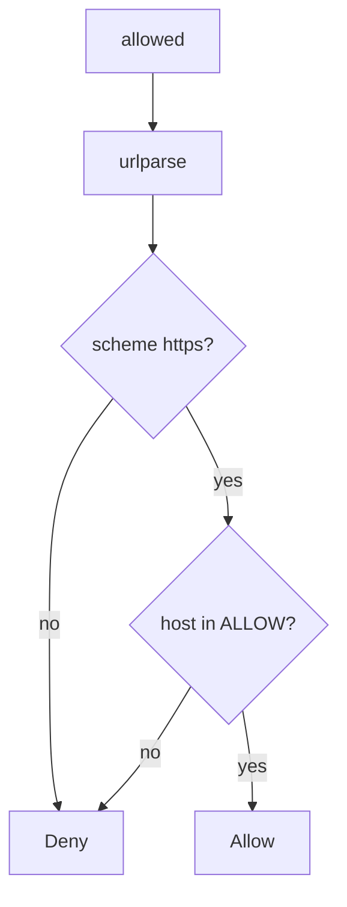

# 6.5-LO-04 — Parse, then allow-list host and scheme

**Kind:** design-exercise
**Loop step:** 4 Build
**Standards:** OWASP ASVS 5.0.0 (final) `v5.0.0-1.3.6`.

## Structural means the authority is a named peer

`allowed` must parse the URL, require `https`, require the hostname in a small allow-list, and deny link-local and loopback. Structural means that identity check — not “starts with https”, not a denylist of one IP.

## Mental model: deny unless listed



Fail-safe: unknown host **denies**.

## Why this restores the cell

| After the fix | Must be true |
|---|---|
| link-local metadata URL | false |
| loopback | false |
| `https://lab.securecollab.test/og` | true |

## What this is not

HTTPS-only regex that still allows a metadata IP. Following redirects off the list. `file:` because the scheme is “local.” Pinning DNS as complete without a proxy.

## Practice

Name the predicate. Run:

```
python3 -m pytest labs/6.5/6.5-lab/tests --impl fixed
```

Must pass.

## Transfer

Clinic: stop fetching whatever URL the form posted.

## Residual risk

DNS rebinding; IPv6 encodings; `v5.0.0-3.7.3` Level 3 user notification on external redirects; dedicated egress proxy for customer sites.
