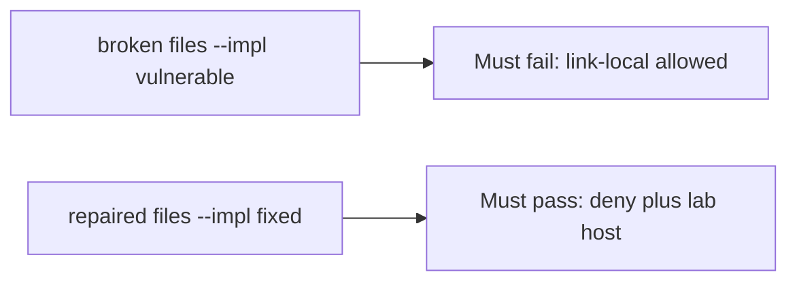

# Allowing a link-local address must fail the check

**Kind:** verification-lab
**Loop step:** 5 Verify

## Check it

“We block private IPs” is not evidence. “HTTPS only” is a tool observation. The check is: `allowed` is false for the named link-local metadata URL and for loopback, and true for the named lab host on https. That observation must be **false** on the broken files (returns true for link-local) and **true** on the repaired files. Tests **must not** fetch.

## Picture: link-local allowed must fail the check

A check that only counts passing cases can still look green while link-local is still allowed.



If both pass, the test is not looking at link-local.

## What the check has to show

| Mode | Must show for this topic |
|---|---|
| Normal | Named lab host on https allowed (may pass on both) |
| Wrong input / abuse | Link-local metadata URL denied; loopback denied; broken must fail |
| Failure | If you cannot name the host, do not fetch |
| Not claimed | Live fetch; DNS rebinding; redirects; IPv6 |

The test `test_link_local_metadata_is_denied` is there so a scheme-only allow still fails. The destination is a **string** in the practice files — do not send packets to it.

A test that only asserts the preview image loaded is not this topic’s evidence. A test that only greps `https` in a prefix check without calling `allowed` on the link-local string is not this topic’s evidence. This practice never fetches.

```text
python3 -m pytest labs/6.5/6.5-lab/tests --impl vulnerable
python3 -m pytest labs/6.5/6.5-lab/tests --impl fixed
```

Honest lab-host https may pass on both (broken files allow any https). That does not excuse the link-local and loopback tests. If the broken files do not fail link-local, the lab is miswired — fix the wiring, not the assertion. A setup error is not proof the rule holds.

## What the tests do not prove

- Redirect following
- DNS rebinding / IP pin
- Open-redirect UX (sister check; telling the person they left is advanced)
- Webhook signing (7.3)
- A production egress proxy

## Practice

```text
python3 -m pytest labs/6.5/6.5-lab/tests --impl vulnerable
python3 -m pytest labs/6.5/6.5-lab/tests --impl fixed
```

Reject a “test” that only greps `https` in a prefix check without calling `allowed` on the link-local string.

## Use it somewhere new

Clinic PDF URL. A test that only asserts the preview image loaded is not this check (see 9.3). A test that fetches a live URL is out of scope.

## What this page is not doing

Do not fetch. Do not log full URLs if they contain tokens. Answer keys are not on this site.
