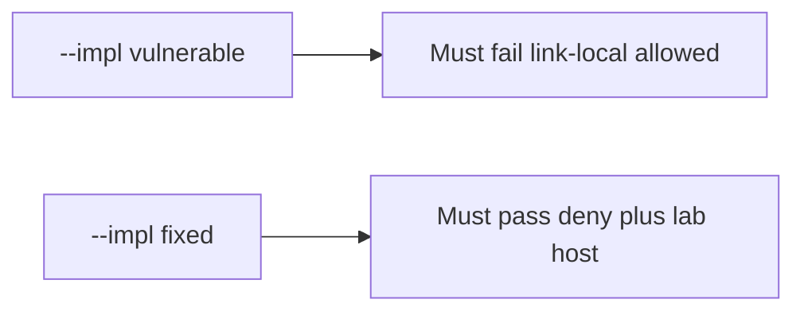

# 6.5-LO-05 — Evidence is link-local deny, then a passing pair

**Kind:** verification-lab
**Loop step:** 5 Verify
**Standards:** OWASP ASVS 5.0.0 (final) `v5.0.0-1.3.6`.

## An invariant that cannot fail a test is still a slogan

“We block private IPs” is not evidence. “HTTPS only” is a mechanism observation. The oracle is: `allowed` is false for the named link-local metadata URL and for loopback, and true for the named lab host on https. The link-local observation must be **false** on `--impl vulnerable` (returns true) and **true** on `--impl fixed`. Tests **must not** fetch.

## Mental model: vulnerable must fail: link-local allowed

The failing observation on `--impl vulnerable` is **link-local allowed**. A passing collection count is not this cell.



| Mode | Must show for this module |
|---|---|
| Negative / abuse | link-local metadata URL denied; loopback denied; vulnerable must fail |
| Normal | named lab host on https allowed (may pass on both) |
| Not claimed | live fetch; DNS rebinding; redirects; IPv6 |

Lab tests in `labs/6.5/6.5-lab/tests/test_property.py`. `test_link_local_metadata_is_denied` is a **forbidden-outcome** test: a scheme-only allow is not allowed to count as a passing control. The destination is a **string** in the fixture — do not send packets to it.

```text
python3 -m pytest labs/6.5/6.5-lab/tests --impl vulnerable
python3 -m pytest labs/6.5/6.5-lab/tests --impl fixed
```

Honest lab-host https may pass on both (vulnerable allows any https). That does not excuse the link-local and loopback tests. If vulnerable does not fail link-local, the lab is miswired—fix the wiring, not the assertion.

## What the tests do not prove

- Redirect following
- DNS rebinding / IP pin
- Open-redirect UX (`v5.0.0-3.7.2` / `v5.0.0-3.7.3` Level 3)
- Webhook signing (7.3)
- A production egress proxy

Record those as residuals or later modules, not as silent passes.

## Practice

Execute both implementations this session. Write the fail/pass pair next to the matrix row. Reject a “test” that only greps `https` in a prefix check without calling `allowed` on the link-local string.

## Transfer

Clinic PDF URL. A test that only asserts the preview image loaded is not this cell (see 9.3). A test that fetches a live URL is out of scope.

## Non-goals

Do not fetch. Do not log full URLs if they contain tokens. Keys stay out of this file.
