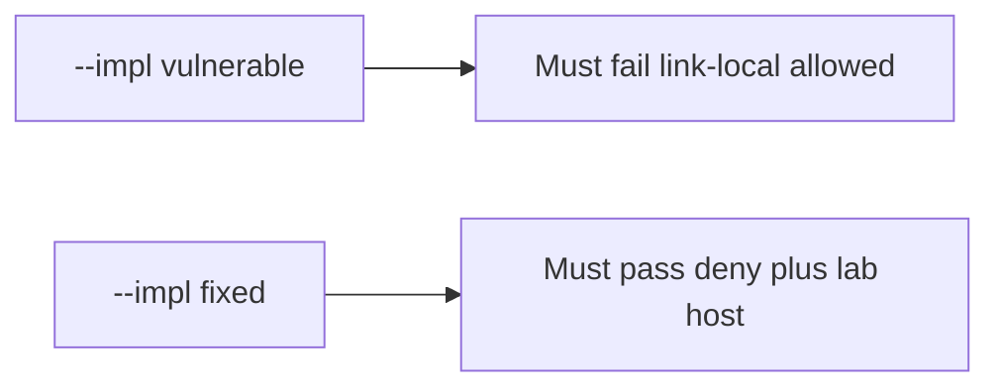

# 6.5-LO-05 — Evidence is link-local deny, then a passing pair

**Kind:** verification-lab
**Loop step:** 5 Verify
**Standards:** OWASP ASVS 5.0.0 (final) `v5.0.0-1.3.6`.

## An invariant that cannot fail a test is still a slogan

“We block private IPs” is not evidence. The oracle is the local pair. Tests **must not** fetch.

## Mental model: vulnerable must fail: link-local allowed

The failing observation on `--impl vulnerable` is **link-local allowed**. A passing collection count is not this cell.



| Case | Must show |
|---|---|
| Negative / abuse | link-local metadata URL denied |
| Negative | loopback denied |
| Normal | named lab host on https allowed |
| Not claimed | live fetch; DNS rebinding; redirects; IPv6 |

```
python3 -m pytest labs/6.5/6.5-lab/tests --impl vulnerable
python3 -m pytest labs/6.5/6.5-lab/tests --impl fixed
```

Honest lab-host https may pass on both (vulnerable allows any https).

## What the tests do not prove

- Redirect following
- DNS rebinding / IP pin
- Open-redirect UX (`v5.0.0-3.7.2` / `v5.0.0-3.7.3` Level 3)
- Webhook signing (7.3)

## Practice

Execute both implementations. Map each test to an LO-02 cell.

## Transfer

Clinic PDF URL. A test that only asserts the preview image loaded is not this cell.
