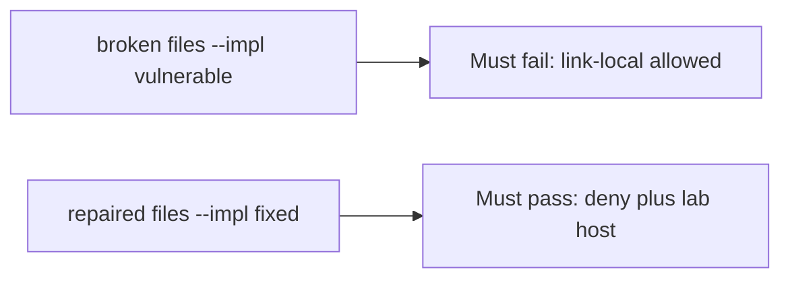

# Allowing a link-local address must fail the check

**Kind:** verification-lab
**Loop step:** 5 Verify

## Check it

A private-IP denylist does not cover link-local metadata. “HTTPS only” is a scheme check. `allowed` has to be false for the named link-local metadata URL and for loopback, and true for the named lab host on https. On the broken files link-local still returns true. On the repaired files it does not. Tests **must not** fetch.

## Picture: link-local allowed must fail the check

Link-local can still be allowed even when the suite is green.



If the broken unfurl still passes, the link-local deny was never the case.

## What the check has to show

| Mode | Must show for this topic |
|---|---|
| Normal | Named lab host on https allowed (may pass on both) |
| Wrong input / abuse | Link-local metadata URL denied; loopback denied; broken must fail |
| Failure | If you cannot name the host, do not fetch |
| Not claimed | Live fetch; DNS rebinding; redirects; IPv6 |

The test `test_link_local_metadata_is_denied` is there so a scheme-only allow still fails. The destination is a **string** in the practice files — do not send packets to it.

An `https` prefix check is not `allowed` on the link-local string. This practice never fetches.

```text
python3 -m pytest labs/6.5/6.5-lab/tests --impl vulnerable
python3 -m pytest labs/6.5/6.5-lab/tests --impl fixed
```

The named lab host on https may pass on both sides (broken files allow any https). You still have to deny link-local and loopback. If the broken files do not fail link-local, the lab is miswired — fix the wiring, not the assertion. A setup error is not proof the rule holds.

## What the tests do not prove

- Redirect following
- DNS rebinding / IP pin
- Open-redirect UX (sister check; telling the person they left is advanced)
- Webhook signing (7.3)
- A production egress proxy

## Practice

Call `allowed` on the link-local string. An `https` prefix is the scheme, not the destination.

## Use it somewhere new

A preview image that loaded is the fetch, not the link-local deny (see 9.3). Do not run a test that fetches a live URL.

## What this page is not doing

Do not fetch. Do not log full URLs if they contain tokens. Answer keys are not on this site.
