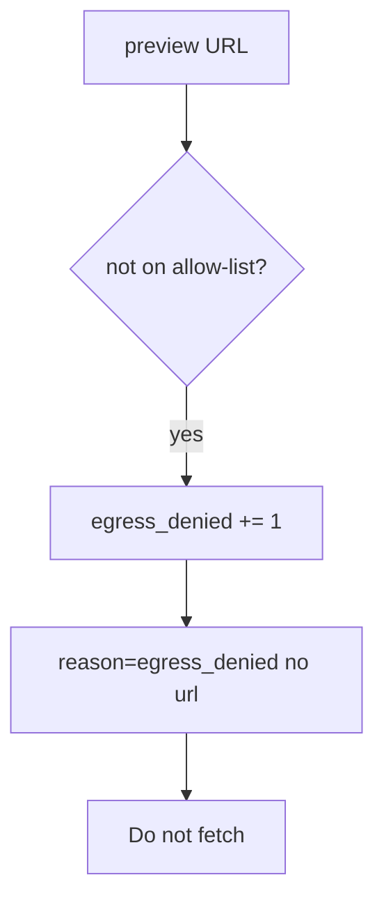

# 6.5-LO-06 — Detect egress_denied

**Kind:** operations-exercise
**Loop step:** 6 Operate
**Standards:** NIST CSF 2.0 (final) DE/RS/RC as outcome labels; OWASP ASVS 5.0.0 (final) `v5.0.0-1.3.6`. CSF names outcomes; it does not allow-list hosts.

## Prevention is not absolute

A new webhook path can fetch again after `allowed` was “fixed once.” Pair detect and recover. Do not log full URLs if they contain tokens (4.3). Do not fetch the denied destination “to confirm.”

## Mental model: SSRF denied host is a signal



| Outcome | This module |
|---|---|
| Detect | `egress_denied` |
| Signal | request id, reason code; never the full URL if it holds secrets |
| Recover | Keep deny; do not rotate a real instance role in this course |
| Residual | DNS rebinding; customer-URL proxy |

CSF 2.0 Detect / Respond / Recover name outcomes. They do not prove `v5.0.0-1.3.6`. A cloud WAF product name is not the property. Re-run `test_link_local_metadata_is_denied` after any importer change; a green “HTTPS only” tile is not that pytest. Webhooks (7.3) are another path of the same deputy — inventory them before claiming Recover.

Recovery is incomplete if the next worker still calls `requests.get` on the form URL. Grep importers the same day you keep the deny, and **do not fetch** the denied destination to confirm.

## Framework defaults versus the operate guarantee

A cloud metadata dashboard will show “IMDSv2 required” and stay silent when the unfurl helper still allows any https host. Detection must observe **`allowed` false before any GET**, not a packet capture. If the alert includes a full URL with a query token, you have opened a 4.3 cell. **Do not fetch to confirm.**

## Practice

Write one log line you would accept. Tie it to `labs/6.5/6.5-lab`.

```text
log_denied reason=egress_denied class=link_local request_id=req_65e
```

Reject any line that includes a full URL with a query token, a note body, or a live-fetch transcript.

## Transfer

Clinic: detect PDF fetches to non-allow-listed hosts; do not paste the URL into the ticket if it has a token. Do not fetch.

## Non-goals

A cloud WAF product name is not the property. Live metadata probes are out of scope. Gates 0–10 stay not-attempted.
