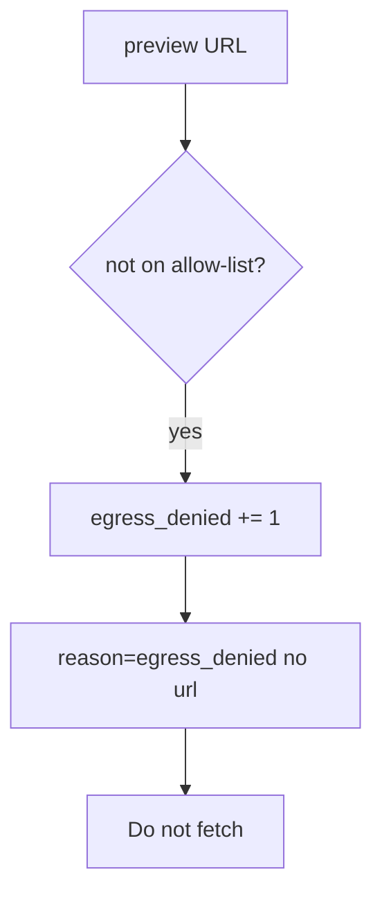

# Notice egress_denied

**Kind:** operations-exercise
**Loop step:** 6 Operate

## Fixing it once is not enough

A new webhook path can fetch after `allowed` denies link-local hosts. Page the unexpected fetch, cut the webhook, and keep the deny.

Keep token-bearing URLs out of the ticket. Do not fetch the denied destination “to confirm.”

## Picture: a denied host is a signal

If a preview URL is not on the allow-list, do not paste the URL into the pager. Then keep the deny. Do not fetch the destination.



An “HTTPS only” product does not put the preview host on the allow-list.

## Signals that do not become a second leak

| Outcome | This topic |
|---|---|
| Notice | `egress_denied` |
| What the line holds | request id, reason code; never the full URL if it holds secrets |
| Respond | Keep the deny; do not fetch |
| Recover | Keep deny; do not rotate a real cloud role as homework |
| Leftover | DNS rebinding; customer-URL proxy |

```text
log_denied reason=egress_denied class=link_local request_id=req_65e
```

Not: a full URL with a query token, a note body, a live-fetch transcript, or “the web filter caught it.”

Putting a full URL with a query token in the alert leaves a second copy (4 in the pager.3).

An “HTTPS only” toggle does not keep link-local URLs off the allow-list. A link-local URL still has to fail `test_link_local_metadata_is_denied`. Webhook delivery (7.3) is another deputy; name it before you fetch.

Recovery is incomplete if the next worker still calls `requests.get` on the form URL. Grep importers the same day you keep the deny, and **do not fetch** the denied destination to confirm.

## What the framework does vs what you still have to check

A cloud dashboard will show “instance metadata requires a token” and stay silent when the unfurl helper still allows any https host. Detection must observe **`allowed` false before any GET**, not a packet capture. If the alert includes a full URL with a query token, you have opened a leftover hole from topic 4.3. **Do not fetch to confirm.**

## Practice

Write a log line (ids, reason, no URL). Reject any line that includes a full URL with a query token, a note body, or a live-fetch transcript.

## Use it somewhere new

Notice PDF fetches to hosts that are not on the allow-list; do not paste the URL into the ticket if it has a token. Do not fetch.

## What this page is not doing

A cloud web-filter name does not deny link-local metadata. Do not use live metadata probes. This site does not mark you as finished. Answer keys are not on this site.
