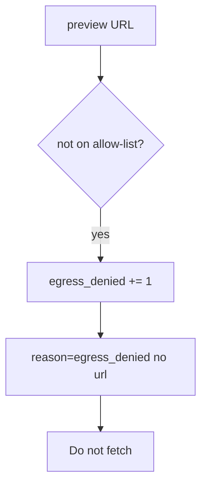

# Notice egress_denied

**Kind:** operations-exercise
**Loop step:** 6 Operate

## Fixing it once is not enough

Even after `allowed` was “fixed once,” a new webhook path can fetch again. Running it for real is the rest of the loop: notice, contain, and keep the deny.

Do not log full URLs if they contain tokens (4.3). Do not fetch the denied destination “to confirm.”

## Picture: a denied host is a signal

A deny of a preview URL that is not on the allow-list still has to show up as an alert. Do not paste the URL into the pager. Then keep the deny. Neither fetches the destination.



A vendor name does not allow-list hosts. Someone still has to own the importer path.

## Signals that do not become a second leak

| Outcome | This topic |
|---|---|
| Notice | `egress_denied` |
| What the line holds | request id, reason code; never the full URL if it holds secrets |
| Respond | Keep the deny; do not fetch |
| Recover | Keep deny; do not rotate a real cloud role as homework |
| Leftover | DNS rebinding; customer-URL proxy |

```text
log_denied reason=egress_denied class=link_local request_id=req_65e
```

Not: a full URL with a query token, a note body, a live-fetch transcript, or “the web filter caught it.”

If your alert includes a full URL with a query token, the pager now holds a second copy (4.3).

A green “HTTPS only” tile is not that check. Re-run `test_link_local_metadata_is_denied` after any importer change. Webhooks (7.3) are another path of the same deputy — inventory them before claiming recover.

Recovery is incomplete if the next worker still calls `requests.get` on the form URL. Grep importers the same day you keep the deny, and **do not fetch** the denied destination to confirm.

## What the framework does vs what you still have to check

A cloud dashboard will show “instance metadata requires a token” and stay silent when the unfurl helper still allows any https host. Detection must observe **`allowed` false before any GET**, not a packet capture. If the alert includes a full URL with a query token, you have opened a leftover hole from topic 4.3. **Do not fetch to confirm.**

## Practice

Write a log line (ids, reason, no URL). Reject any line that includes a full URL with a query token, a note body, or a live-fetch transcript.

## Use it somewhere new

A clinic example: notice PDF fetches to hosts that are not on the allow-list; do not paste the URL into the ticket if it has a token. Do not fetch.

## What this page is not doing

A cloud web-filter name is not this check. Do not use live metadata probes are out of scope. This site does not mark you as finished. Answer keys are not on this site.
