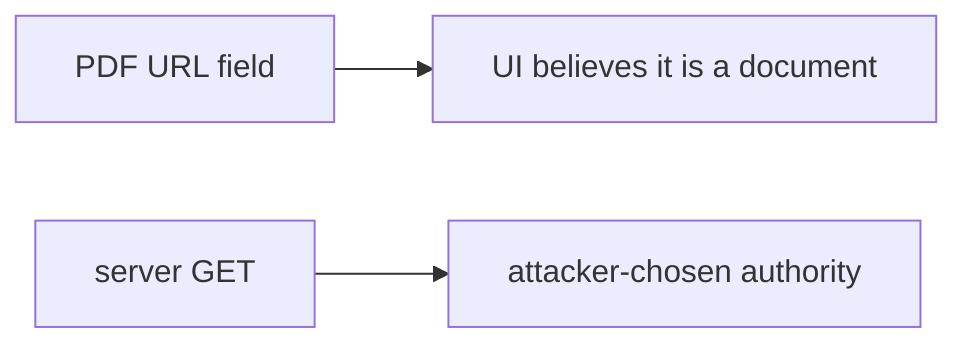

# 6.5-LO-07 — Transfer: clinic fetch lab-result PDF from URL

**Kind:** transfer-challenge
**Loop step:** 7 Transfer
**Standards:** OWASP ASVS 5.0.0 (final) `v5.0.0-1.3.6`. `v5.0.0-3.7.3` Level 3 advanced for user-facing redirects.

## Change the workplace; keep parse-then-allow-list

Do not answer with a Top 10 / CWE / scanner as the definition of security. The SecureCollab sentence was: `allowed` must be false for a link-local metadata URL. Rewrite it for a clinic without changing the fork.

**Prompt:** Clinic “fetch lab result PDF from URL.” Also name webhook delivery (7.3) as the same egress deputy.

**Product sketch:** EHR-lite importer that `GET`s whatever URL the form posted.

Rewrite the SecureCollab sentence. Include:

1. attacker capabilities (URL field — not a live clinic or cloud metadata probe);
2. trust assumptions (parsed host allow-list is TCB; “https” prefix is not);
3. forbidden outcome (`allowed` true for link-local, not “HIPAA”);
4. a test idea on a **local** fixture only (predicate, no fetch);
5. residual (redirects, DNS rebinding, IPv6, `file:`, Level 3 redirect notice);
6. WCAG if a human “could not fetch PDF” path is in the claim (readable error, not a spinner that retries the bad URL).

## Mental model: the PDF URL is still an egress steering wheel

If the importer GETs whatever URL the form posted, the cell is gone. FastAPI, an HTTPS prefix, and a private-IP denylist of one address do not name the peer. Webhook delivery (7.3) is the same deputy with a different verb. Open-redirect UX is a sister cell (`v5.0.0-3.7.2`); do not fetch to demonstrate it.

The clinic rewrite still has to keep the SecureCollab fork: link-local and loopback are false; only the named lab (or clinic) host on https is true. Switching the importer to HTTPS without a host allow-list leaves the server as deputy. The local pytest analogue is `test_link_local_metadata_is_denied` — on a fixture, not a live PDF or metadata endpoint.

## What graders reject

| Reject | Why |
|---|---|
| “HTTPS only” | Scheme is not host identity |
| Live metadata / clinic probe | Lab policy |
| API7 as the property | Awareness after the cause |
| HTTP 200 as egress evidence | Wrong observation |
| Fetching to confirm the deny | Lab policy |

## Practice

One page. No keys. `labs/6.5/6.5-lab` is the only running system you may break. Do not fetch.

## Non-goals

Live-target SSRF. Real PDFs or metadata. Claiming Gate 6 from this page.
