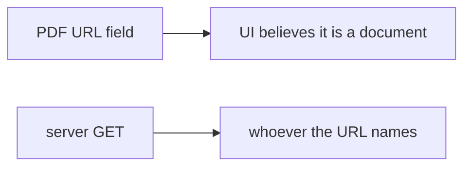

# Same idea: clinic fetch of a lab-result PDF

**Kind:** transfer-challenge
**Loop step:** 7 Transfer

## Use it somewhere new

The notes-app scaffolding goes away. You get a clinic form that **fetches a lab-result PDF from a URL**. Your job is to rewrite the loop, not to name a bug-list code.

The notes-app sentence was: `allowed` must be false for a link-local metadata URL. Parse, then allow-list host and scheme. Rewrite it for a clinic without changing the fork: the importer must not treat the posted URL as permission to dial.

Also name webhook delivery (7.3) as the same egress deputy, without running those systems.

## Picture: the PDF URL is still a steering wheel

Renaming “preview URL” to “PDF URL” is not transfer. The untrusted string changes. The fork does not.

| Notes app this week | Clinic sketch |
|---|---|
| Preview URL on a note | Lab-result PDF URL on a form |
| `allowed` | Importer allow-check |
| Parse, then host and scheme allow-list | Same check before any GET |
| Member supplying a preview URL | Clinician supplying a PDF URL — **not** a live clinic |

If the importer GETs whatever URL the form posted, the check is gone. FastAPI, an HTTPS prefix, and a private-IP denylist of one address do not name the peer. Webhook delivery (7.3) is the same deputy with a different verb. Open-redirect UX is a sister check; do not fetch to demonstrate it.

The clinic rewrite still has to keep the notes-app fork: link-local and loopback are false; only the named lab (or clinic) host on https is true. Switching the importer to HTTPS without a host allow-list leaves the server as deputy. The local pytest analogue is `test_link_local_metadata_is_denied` — on a practice, not a live PDF or metadata endpoint.

## Prompt — clinic fetch of a lab-result PDF

Rewrite the notes-app sentence. Include:

1. who can act (URL field — not a live clinic or cloud metadata probe);
2. what you trust (parsed host allow-list; “https” prefix is not);
3. what must not happen (`allowed` true for link-local, not a legal label);
4. a test idea on a **local** practice files only (predicate, no fetch — never on the real clinic);
5. leftover (redirects, DNS rebinding, IPv6, `file:`, telling the person they left the site);
6. whether a human-read “could not fetch PDF” status must not use color as the only cue (readable error, not a spinner that retries the bad URL).

## What is not good enough

| Reject | Why |
|---|---|
| “HTTPS only” | Scheme is not host identity |
| Live metadata / clinic probe | Course rules |
| Famous-bugs nickname as the rule | Awareness after the cause |
| HTTP 200 as egress evidence | Wrong observation |
| Fetching to confirm the deny | Course rules |

## Practice

One page. No answer keys. The only running system you may break is `labs/6.5/6.5-lab`. Do not fetch.

## What this page is not doing

Live-target server-side requests. Real PDFs or metadata. Claiming a course gate from this page.
