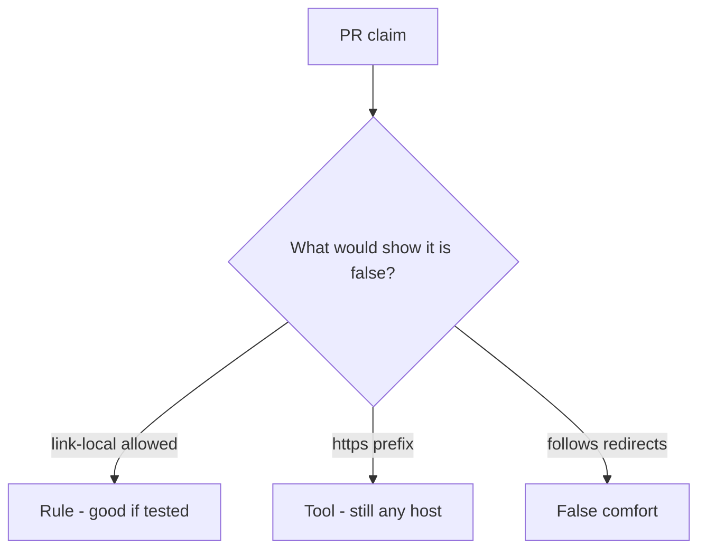

# Review of scheme-only URL checks

**Kind:** code-review
**Loop step:** Review

Intended findings live only in the answer-key folder — not here. Do not open that file until your review has been evaluated.

## What you are reviewing

A colleague ships notes-app unfurl. Review `labs/6.5/6.5-lab/vulnerable/` as that change. Your job is not to count suspicious lines. Reconstruct whether `allowed` is still true for the named link-local metadata URL, compare that with the rule, and write changes a developer can verify.

The check you already ran (`test_link_local_metadata_is_denied`) is the rule test. A comment “will allow-list later” is not.

## Picture: requests.get of the user URL / scheme-only allow

Start with this seeded smell: **`requests.get` of the user URL / scheme-only allow**. Label it rule, tool, or false comfort before you accept the change.

The review starts at the protected effect (link-local denied). Everything that is not parse-then-allow-list at that call is a candidate deputy path. An HTTPS prefix without a host allow-list is the same smell, not a different finding class.

## Problems to find (name them yourself)

- `requests.get` of the user URL / scheme-only allow
- https-only regex that still allows a metadata IP
- Follows redirects off the allow-list
- No link-local deny test

Also reject: live fetches; closing findings without re-running `test_link_local_metadata_is_denied`; keys in learner notes; a web filter as the rule.

## Common mix-ups

- HTTPS URLs cannot steer the server
- Private-IP denylists are complete
- Open redirect is just a user-experience issue
- A famous-bugs nickname is the rule
- Fetching the URL is how you test this check

## Practice

Write three review notes a maintainer could act on. Each note: what you saw, rule or false comfort, suggested structural change, leftover you will **not** delete. Tie at least one note to `test_link_local_metadata_is_denied`. Do not open the keys file.

## Use it somewhere new

Clinic change that “switched the importer to HTTPS” without a host allow-list test is an incomplete review of scheme-only URL checks. Name the independent falsehood that would still keep link-local from being allowed.

## What this page is not doing

Do not merge by adding a comment “will allow-list later.” That comment is leftover without an owner. Do not fetch a live URL to prove the finding.
