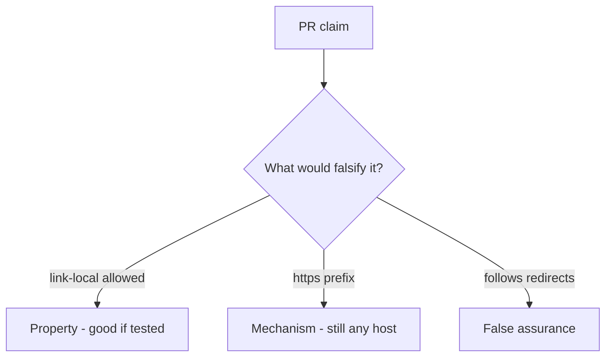

# 6.5-LO-08 — Review scheme-only URL checks as a PR, not an SSRF ticket

**Kind:** code-review
**Loop step:** Review
**Standards:** OWASP ASVS 5.0.0 (final) `v5.0.0-1.3.6`.

## Review the fixture as if it were SecureCollab unfurl

Review `labs/6.5/6.5-lab/vulnerable/` as a SecureCollab PR. Your job is not to count suspicious lines. Reconstruct whether `allowed` is still true for the named link-local metadata URL, compare that with the module invariant, and write changes a developer can verify.

Intended findings live only in `content/assessment/keys/6.5.md` — not here. Do not open the keys file until your review has been evaluated.

## Mental model: requests.get(user_url) / scheme-only allow

Start with this seeded smell: **`requests.get(user_url)` / scheme-only allow**. Label it property, mechanism, or false assurance before you accept the PR.

Classification starts at the protected effect (link-local denied). Everything that is not parse-then-allow-list at that call is a candidate deputy path. An HTTPS prefix without a host allow-list is the same smell, not a different finding class.

## Seeded smells (label them yourself)

- `requests.get(user_url)` / scheme-only allow
- https-only regex that still allows a metadata IP
- Follows redirects off the allow-list
- No link-local deny test

Also reject: live fetches; closing findings without re-running `test_link_local_metadata_is_denied`; keys in lessons.

## Misconceptions this module refuses

- HTTPS URLs cannot SSRF
- Private IP blocklists are complete
- Open redirect is just UX
- API7 is the property
- Fetching the URL is how you test this cell

## Practice

Write three review notes a maintainer could act on. Each note: observation, property or false assurance, suggested structural change, residual you will **not** delete. Tie at least one to `test_link_local_metadata_is_denied`.

## Transfer

Clinic PR that “switched the importer to HTTPS” without a host allow-list test is an incomplete mediation review. Name the independent falsehood that would still keep link-local from being allowed.

## Non-goals

Do not merge by adding a comment “will allow-list later.” That comment is a residual without an owner. Do not fetch a live URL to prove the finding.
