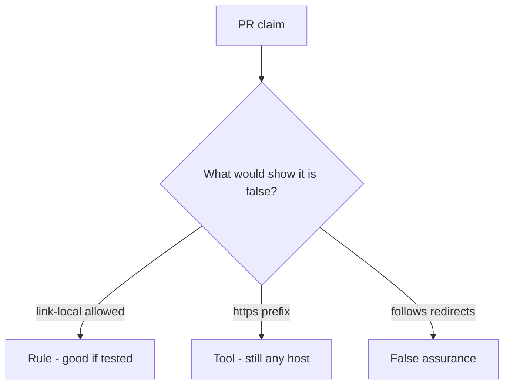

# Review of scheme-only URL checks

**Kind:** code-review
**Loop step:** Review

## What you are reviewing

Open `labs/6.5/6.5-lab/vulnerable/` as an unfurl change. Is `allowed` still true for the named link-local metadata URL?

A TODO to allow-list later does not satisfy `test_link_local_metadata_is_denied`.

## Picture: requests.get of the user URL / scheme-only allow

**`requests.get` of the user URL / scheme-only allow**.

Link-local still has to be denied. If the change never parses then allow-lists, that deputy path is still open. An HTTPS prefix without a host allow-list is still the same problem.

## Problems to find (name them yourself)

- `requests.get` of the user URL / scheme-only allow
- https-only regex that still allows a metadata IP
- Follows redirects off the allow-list
- No link-local deny test

Also reject: live fetches; closing findings without re-running `test_link_local_metadata_is_denied`; keys in learner notes; a web filter as the rule.

## Common mix-ups

- HTTPS URLs cannot steer the server
- Private-IP denylists are complete
- Open redirect is just a user-experience issue
- A famous-bugs nickname is the rule
- Fetching the URL is how you test this check

## Use it somewhere new

HTTPS-only on the importer, without a host allow-list, is still a scheme-only URL check. What would still deny link-local after the importer is HTTPS-only?

## What this page is not doing

Leave “will allow-list later” out of the merge until someone owns the link-local deny. Do not fetch a live URL to prove the finding.
