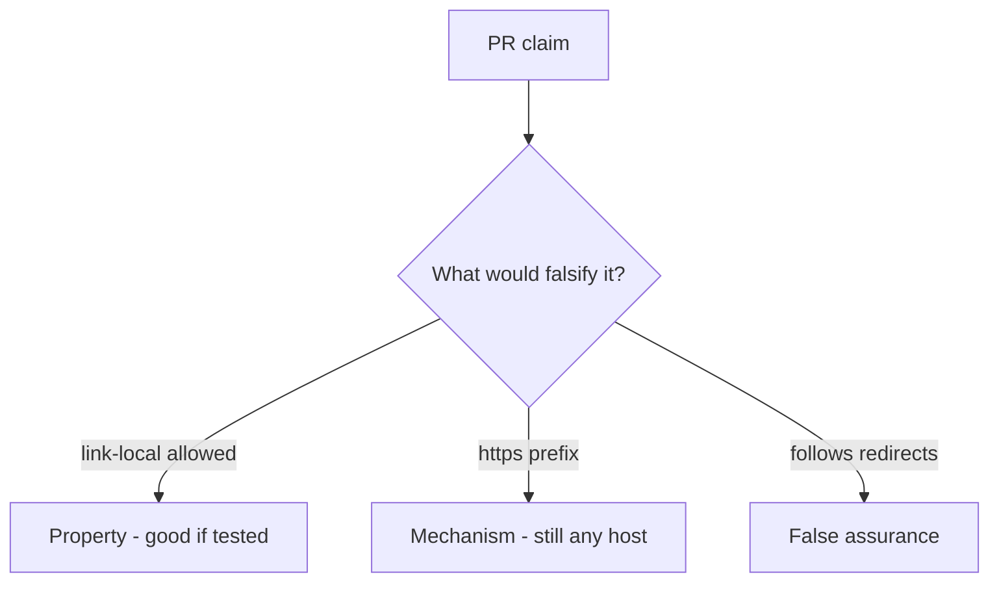

# 6.5-LO-08 — Review scheme-only URL checks as a PR, not an SSRF ticket

**Kind:** code-review
**Loop step:** Review
**Standards:** OWASP ASVS 5.0.0 (final) `v5.0.0-1.3.6`.

## Review the fixture as if it were SecureCollab unfurl

Review `labs/6.5/6.5-lab/vulnerable/` as a SecureCollab PR. Intended findings live only in `content/assessment/keys/6.5.md` — not here.

## Mental model: property, mechanism, or false assurance

Seeded smells (label them yourself; do not open the keys file):

- `requests.get(user_url)` / scheme-only allow
- https-only regex that still allows a metadata IP
- Follows redirects off the allow-list
- No link-local deny test

Also reject: live fetches, keys in lessons.

## Misconceptions

- HTTPS URLs cannot SSRF
- Private IP blocklists are complete
- Open redirect is just UX

## Practice

Write three review notes. Tie at least one to `test_link_local_metadata_is_denied`.

## Transfer

Clinic PR that “switched the importer to HTTPS” without a host allow-list test is incomplete.
