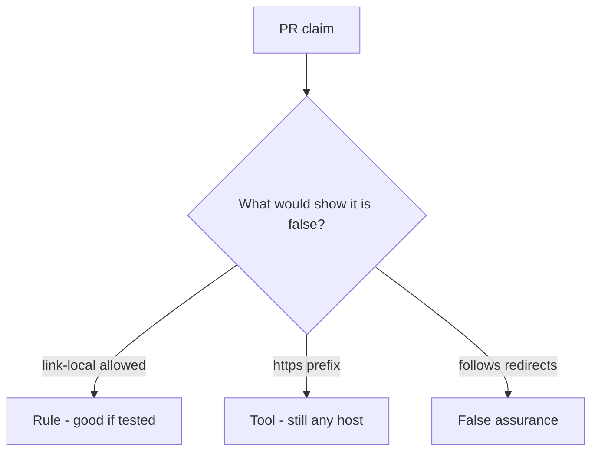

# Review of scheme-only URL checks

**Kind:** code-review
**Loop step:** Review

Wait until someone has looked at your review before opening the keys.

## What you are reviewing

Review `labs/6.5/6.5-lab/vulnerable/` as a change to notes-app unfurl. Check whether `allowed` is still true for the named link-local metadata URL.

The check you already ran (`test_link_local_metadata_is_denied`) is the rule test. A comment “will allow-list later” is not.

## Picture: requests.get of the user URL / scheme-only allow

**`requests.get` of the user URL / scheme-only allow**.

Link-local still has to be denied. If the change never parses then allow-lists, that deputy path is still open. An HTTPS prefix without a host allow-list is still the same problem.

## Problems to find (name them yourself)

- `requests.get` of the user URL / scheme-only allow
- https-only regex that still allows a metadata IP
- Follows redirects off the allow-list
- No link-local deny test

Also reject: live fetches; closing findings without re-running `test_link_local_metadata_is_denied`; keys in learner notes; a web filter as the rule.

## Common mix-ups

- HTTPS URLs cannot steer the server
- Private-IP denylists are complete
- Open redirect is just a user-experience issue
- A famous-bugs nickname is the rule
- Fetching the URL is how you test this check

## Practice

Write the review that blocks this change. Mention `test_link_local_metadata_is_denied`.

## Use it somewhere new

Clinic change that “switched the importer to HTTPS” without a host allow-list test is an incomplete review of scheme-only URL checks. Name the independent falsehood that would still keep link-local from being allowed.

## What this page is not doing

Do not merge by adding a comment “will allow-list later.” That comment is leftover without an owner. Do not fetch a live URL to prove the finding.
